# MyClash — Architecture & Build Specification

> **Free, open-source platform for managing and publishing results of Historical European Martial Arts (HEMA) events.**
>
> This document is the master architectural reference for MyClash. It is written to be both human-readable and consumable by an AI coding agent (Claude Code, Cursor, Aider) as the project's anchor specification.
>
> **Companion docs:**
>
> - `docs/BUILD_ORDER.md` — historical build plan (how the project was sequenced).
> - `docs/OWNER_TASKS.md` — operational checklist for the project owner (full version, organized by project phase).
> - `docs/PRE_DEPLOY_CHECKLIST.md` — flat ordered checklist for everything that must happen before first production deploy.
> - `myclash.md` (root) — functional/design understanding of the app (product-level).
> - `CLAUDE.md` (root) — the agent contract: hard rules, which docs are authoritative, workflow, verification.
> - `DESIGN.md` (root) — canonical UI design language.
> - `docs/ENGINEERING_LESSONS.md` — reusable rules distilled from past mistakes, by area.
>
> **Status:** Draft v1.4 · **Owner:** Project author · **License:** AGPL-3.0
> **Production domain:** `myclash.fr`

---

## Table of Contents

Every `##` section appears here. Sections are cited elsewhere by number (`§14`), so the numbering is
a contract: **renumber an existing section only after repointing every citation to it.** The
`bis`/`ter`/`quater` suffixes mark sections inserted after their neighbours were already cited —
ugly, but cheaper than renumbering. Append new sections at the end instead.

- [1. Project Overview](#1-project-overview)
- [2. Product Surfaces](#2-product-surfaces)
- [3. Tech Stack & Rationale](#3-tech-stack--rationale)
- [4. High-Level System Architecture](#4-high-level-system-architecture)
- [5. Data Model](#5-data-model)
- [6. TF_v1 Ruleset Specification](#6-tf_v1-ruleset-specification)
- [7. Scoring Engine & Ruleset Plugin System](#7-scoring-engine--ruleset-plugin-system)
- [7bis. Ruleset authoring, sharing and pinning](#7bis-ruleset-authoring-sharing-and-pinning)
- [8. Statistics Module](#8-statistics-module)
- [9. Real-Time Architecture](#9-real-time-architecture)
- [10. Offline-First Scoring (PWA + IndexedDB)](#10-offline-first-scoring-pwa--indexeddb)
- [11. HEMA Ratings Integration](#11-hema-ratings-integration)
- [11bis. Workshops Module](#11bis-workshops-module)
- [11ter. Push Notifications](#11ter-push-notifications)
- [11quater. Pool Population & Referee Assignment](#11quater-pool-population--referee-assignment)
- [11sexies. Bracket Auto-Advance](#11sexies-bracket-auto-advance)
- [11quinquies. Following & Public Profiles](#11quinquies-following--public-profiles)
- [12. Authentication & Identity](#12-authentication--identity)
- [13. Per-Event Theming](#13-per-event-theming)
- [14. API Surface](#14-api-surface)
- [15. Frontend Routes](#15-frontend-routes)
- [16. Internationalization](#16-internationalization)
- [17. Deployment (Docker Compose + Traefik)](#17-deployment-docker-compose--traefik)
- [18. Repository Structure (Monorepo)](#18-repository-structure-monorepo)
- [19. Development Roadmap](#19-development-roadmap)
- [20. Conventions & Standards](#20-conventions--standards)
- [21. AI Coder Instructions](#21-ai-coder-instructions)
- [22. Open Questions / Future Work](#22-open-questions--future-work)
- [23. Referee Financial Compensation (T-1209)](#23-referee-financial-compensation-t-1209)
- [24. Event Schedule Planner (T-1210)](#24-event-schedule-planner-t-1210)
- [25. Live Schedule View (T-1211)](#25-live-schedule-view-t-1211)
- [26. AI Infrastructure (T-1212)](#26-ai-infrastructure-t-1212)

---

## 1. Project Overview

### 1.1 Mission

MyClash is a free, open-source platform that lets any HEMA event organizer:

- Create and run tournaments end-to-end (registration → pools → eliminations → publication).
- Score matches at the piste (called **Lice**) with per-exchange granularity, even on flaky venue wifi.
- Publish live results, brackets, rankings, and rich post-event statistics.
- Offer a per-event public-facing experience (themed mini-app) for spectators and competitors.

It replaces the workflow people currently piece together with `hemaScorecard` + spreadsheets + static HTML pages (cf. `https://lyonamhe.fr/resultat_fal2026.html`).

### 1.2 Why this is not a clone of hemaScorecard

|              | hemaScorecard         | MyClash                                                                                         |
| ------------ | --------------------- | ----------------------------------------------------------------------------------------------- |
| Scoring      | Per-match final score | Per-exchange (every clean hit, afterblow, double captured)                                      |
| Statistics   | Pool standings only   | Full exchange-level analytics, target zones, double-rate evolution, "deep hunters" leaderboards |
| Public app   | None (HTML export)    | Per-event themed PWA with 3 personas (Competitor / Accompanist / Public)                        |
| Mobile       | Desktop-first         | Mobile-first PWA, installable                                                                   |
| Live         | Manual refresh        | Realtime broadcast (sub-second)                                                                 |
| Offline      | None                  | Scoring tablet works fully offline, syncs on reconnect                                          |
| Identity     | Per-event             | Global fighter profiles, linkable to HEMA Ratings                                               |
| Multi-tenant | Single-event install  | Platform with per-event theming                                                                 |

### 1.3 Constraints

- **Free for organizers and competitors.** No paywalled features.
- **Self-hostable.** Single `docker compose up`.
- **Open source.** Public Git repository.
- **No vendor lock-in.** Standard Postgres, no proprietary cloud services in the critical path.

---

## 2. Product Surfaces

MyClash is **five distinct surfaces** sharing one backend:

### 2.1 Public/Spectator App (PWA, mobile-first)

Per-event themed (logo, colors, history pages, club directory). Personas chosen during onboarding — **non-exclusive: a single user can be Competitor + Referee + Workshop Attendee simultaneously**. The "My Schedule" view aggregates whichever apply.

- **Competitor** — "my next match", "my pool standings", "my results", "where I need to be".
- **Referee** — today's assigned matches, my piste schedule, on-piste tools (start clock, call halt/warning, request scorekeeper attention).
- **Workshop Attendee** — selected workshops, capacity status, conflicts with my matches/refereeing.
- **Accompanist** — follow favorite fighters, live tracking on multiple Lices.
- **Public** — discover HEMA, event editorial, schedule, club directory.

The **"My Schedule"** view is the unified personal view (matches the beta companion app at `https://myfal.lyonamhe.fr/`). It overlays:

- My fights (as competitor)
- My refereeing assignments
- My selected workshops
- Conflict markers when any two overlap
- Day filter (Saturday/Sunday)
- "Focus on me" vs "Show all" toggle

Reference design: the prototype HTML (Cinzel + Inter typography, red/blue HEMA palette, gold accents, shield motifs). This design system is **canonical** and ports directly to the production app. Beta companion app at `https://myfal.lyonamhe.fr/` is the reference for "My Schedule" interaction.

### 2.2 Scorekeeper App (PWA, tablet-first, offline-tolerant)

Used at each Lice by a designated scorekeeper. One device per Lice. Functions:

- View current match assignment (red vs blue, weapon, ruleset).
- Match clock (start/pause/halt/resume).
- Per-exchange entry: clean hit (red/blue, 1pt/2pt), afterblow (with retaliation value), double, no-exchange.
- Undo last exchange.
- Finalize match → push to backend.
- Works fully offline; queues exchanges to IndexedDB; syncs when network returns.

### 2.3 Organizer Admin (responsive web, desktop-first)

Per-organizer team. Functions:

- Create event, configure tournaments (weapon/category), select rulesets, configure theming.
- Register fighters (with link to global profile / HEMA Ratings).
- Generate pools (configurable seeding) and elimination brackets (single elim, double elim, swiss).
- Assign matches to Lices, manage piste schedule.
- Review and edit scores (with audit trail).
- Publish results, generate statistics page, export to HEMA Ratings format.

### 2.4 Super Admin (responsive web)

Platform-level admin (you). Functions:

- Approve and manage organizer accounts.
- Enable/disable organizers.
- Moderate global fighter profiles (merge duplicates, handle disputes).
- Manage rulesets (approve community-submitted rulesets).
- Platform-wide stats and monitoring.
- Feature flags.

### 2.5 Marketing Site (static, apex domain)

`myclash.fr` — commercial landing page served as a static HTML file. No build step required. Content:

- Product pitch and feature overview.
- How-it-works flow.
- Donation / support section (HelloAsso link).
- Login CTA → `app.myclash.fr`.

App: `apps/web-marketing/index.html`. Served by Caddy (`FROM caddy:2-alpine`, generated Caddyfile) or directly by Traefik file server. No Next.js runtime.

---

## 3. Tech Stack & Rationale

### 3.1 Decisions

| Layer                         | Choice                                                          | Rationale                                                                                                                                                                                     |
| ----------------------------- | --------------------------------------------------------------- | --------------------------------------------------------------------------------------------------------------------------------------------------------------------------------------------- |
| Frontend (all PWAs)           | **Next.js 16** (App Router) + TypeScript + Tailwind + shadcn/ui | SSR for fast public results pages; PWA support; mature ecosystem; TypeScript end-to-end                                                                                                       |
| Backend                       | **NestJS 11** + TypeScript                                      | Modular, opinionated, excellent for domain-rich apps; first-class WebSocket gateway; matches user preference                                                                                  |
| Database                      | **PostgreSQL 17** (via Supabase)                                | Deeply relational domain; `LISTEN/NOTIFY` for realtime; mature tooling; AGPL-friendly                                                                                                         |
| ORM                           | **None** — PostgREST + raw SQL                                  | Reads go through `SupabaseService`; migrations are hand-written SQL. A Drizzle mirror was carried until 2026-08 and deleted: nothing imported it and it had drifted from the SQL it described |
| Realtime                      | **Supabase Realtime** (Phoenix Channels)                        | Postgres-native broadcast on row changes; zero glue code for the read-side                                                                                                                    |
| Auth                          | **Supabase Auth** (email magic link + Google OAuth)             | Self-hostable, JWT-based, integrates with Postgres RLS                                                                                                                                        |
| Object Storage                | **Supabase Storage** (S3-compatible)                            | Fighter photos, event logos, podium photos                                                                                                                                                    |
| Background jobs               | **BullMQ** (Redis-backed)                                       | Stats recomputation, HEMA Ratings sync, exports                                                                                                                                               |
| Cache + pub/sub               | **Redis 8**                                                     | BullMQ + L2 cache for ranking queries                                                                                                                                                         |
| Reverse proxy                 | **Traefik v3**                                                  | Automatic Let's Encrypt, label-based config, native Docker integration                                                                                                                        |
| Container                     | **Docker + Docker Compose**                                     | User requirement                                                                                                                                                                              |
| Monorepo tool                 | **pnpm workspaces** + **Turborepo**                             | Fast, simple, well-supported                                                                                                                                                                  |
| Client state                  | **TanStack Query** (React Query) + **Zustand**                  | Server state vs UI state separation                                                                                                                                                           |
| Forms                         | **React Hook Form** + **Zod**                                   | Schema validation shared with backend                                                                                                                                                         |
| Heavy compute                 | **Web Workers** (via Comlink)                                   | Bracket generation, ranking computation, statistics aggregation off the main thread                                                                                                           |
| Local-first storage (scoring) | **IndexedDB** (via Dexie.js)                                    | Offline exchange queue                                                                                                                                                                        |
| Charts                        | **Recharts** + **D3** for custom viz                            | Statistics page                                                                                                                                                                               |
| Testing                       | **Vitest** (unit) + **Playwright** (E2E)                        | Modern, fast                                                                                                                                                                                  |
| CI/CD                         | **GitHub Actions**                                              | Standard                                                                                                                                                                                      |

### 3.2 Why Supabase + NestJS together (not "one or the other")

- **Supabase** handles: auth, storage, realtime broadcast, the Postgres database itself.
- **NestJS** handles: business logic, ruleset engine, bracket generation, statistics aggregation, HEMA Ratings sync, complex transactions.

The Next.js frontends talk to **NestJS for mutations** and to **Supabase Realtime for live read-side subscriptions**. Reads can also go through NestJS for aggregation endpoints. This split avoids cramming domain logic into Postgres functions while keeping realtime trivial.

### 3.3 Frontend "multi-threading"

Three distinct mechanisms, each addressing a different concern:

1. **Web Workers** (Comlink) — bracket generation, ranking recomputation, exchange aggregation for stats. The scoring tablet must never freeze when the organizer adds 64 fighters.
2. **Server Components (Next.js)** — public results pages render server-side, ship minimal JS.
3. **Realtime subscriptions** — the UI listens to Supabase Realtime channels per Lice / per match, pushing updates without polling.

---

## 4. High-Level System Architecture

```
                           ┌────────────────────────────────┐
                           │            Traefik             │
                           │   (TLS, routing, Let's Enc.)   │
                           └─┬──────┬──────┬──────────┬─────┘
                             │      │      │          │
                  ┌──────────▼──┐ ┌─▼────┐ ┌─▼──────┐ ┌─▼─────────┐
                  │  Next.js    │ │ Next │ │ Next   │ │ Supabase  │
                  │  (Public/   │ │ (Sco-│ │ (Admin │ │ (Auth,    │
                  │  Spectator) │ │ ring)│ │ + Super│ │ Storage,  │
                  │             │ │      │ │ Admin) │ │ Realtime) │
                  └──────────┬──┘ └─┬────┘ └─┬──────┘ └─┬─────────┘
                             │      │        │           │
                             └──────┴────┬───┴───────────┘
                                         │
                                  ┌──────▼─────────┐
                                  │    NestJS API  │
                                  │  (REST + WS)   │
                                  └──────┬─────────┘
                                         │
                       ┌─────────────────┼─────────────────┐
                       │                 │                 │
                ┌──────▼──────┐   ┌──────▼──────┐   ┌──────▼──────┐
                │  PostgreSQL │   │    Redis    │   │ HEMA Ratings│
                │  (Supabase) │   │ (cache+jobs)│   │ (pull-only) │
                └─────────────┘   └─────────────┘   └─────────────┘
```

### 4.1 Service responsibilities

| Service             | Responsibility                                                                                               |
| ------------------- | ------------------------------------------------------------------------------------------------------------ |
| `web-public`        | Public/Spectator + Competitor PWA. SSR public pages (`/e/[eventSlug]/...`).                                  |
| `web-staff`         | Scorekeeper PWA. Heavily client-side, IndexedDB-backed.                                                      |
| `web-admin`         | Organizer Admin + Super Admin SPA-like experience.                                                           |
| `web-marketing`     | Static HTML on Caddy — `myclash.fr` apex landing page.                                                       |
| `api`               | NestJS — domain logic, REST + WebSocket gateway, BullMQ producer.                                            |
| `worker`            | NestJS in worker mode (`--worker`) — BullMQ consumer (stats, exports, Ratings sync, notifications).          |
| `db`                | Postgres 17 from the Supabase image (`supabase/postgres:17.6.1.160`), with the Supabase init scripts.        |
| `redis`             | Redis 8 — cache + BullMQ queue + pub/sub. 512 MB max, appendonly.                                            |
| `supabase-auth`     | GoTrue — email magic link + Google OAuth, JWT-based session.                                                 |
| `supabase-realtime` | Phoenix Channels broadcasting Postgres row changes to subscribers.                                           |
| `supabase-storage`  | S3-compatible object storage for fighter photos, club logos.                                                 |
| `supabase-rest`     | PostgREST over the public schema, served at `/rest/v1`.                                                      |
| `traefik`           | Reverse proxy + TLS termination (Let's Encrypt). Routes by hostname to every public-facing service.          |
| `ops-runner`        | Bearer-authed sidecar with `/var/run/docker.sock` mounted. Backups, restore, container lifecycle. See §17.4. |

> The three frontends could be a single Next.js app with route-based feature flags. **Decision: keep them as three apps in the monorepo**, sharing UI components via a `packages/ui` workspace. This isolates the scoring app (offline-first, very different UX) and the admin app (heavier, desktop-first) from the lean public PWA.
>
> Neither stack includes Kong. Earlier Supabase self-hosting setups used Kong as an API gateway; MyClash fronts every Supabase service directly through Traefik labels in **both** production and local dev. Kong was removed from the dev compose along with `infra/supabase/kong.yml`, so dev now exercises the same edge path that serves production.

---

## 5. Data Model

### 5.1 Core entities (ER overview)

The competition chain runs **organization → event → tournament → phase → match → exchange**. An `event`
is the real-world gathering ("Dijon Open 2026"); a `tournament` is one weapon × category bracket inside
it ("Longsword Open"). Relationships below are the actual foreign keys — see
`packages/db/migrations/0001_init.sql`.

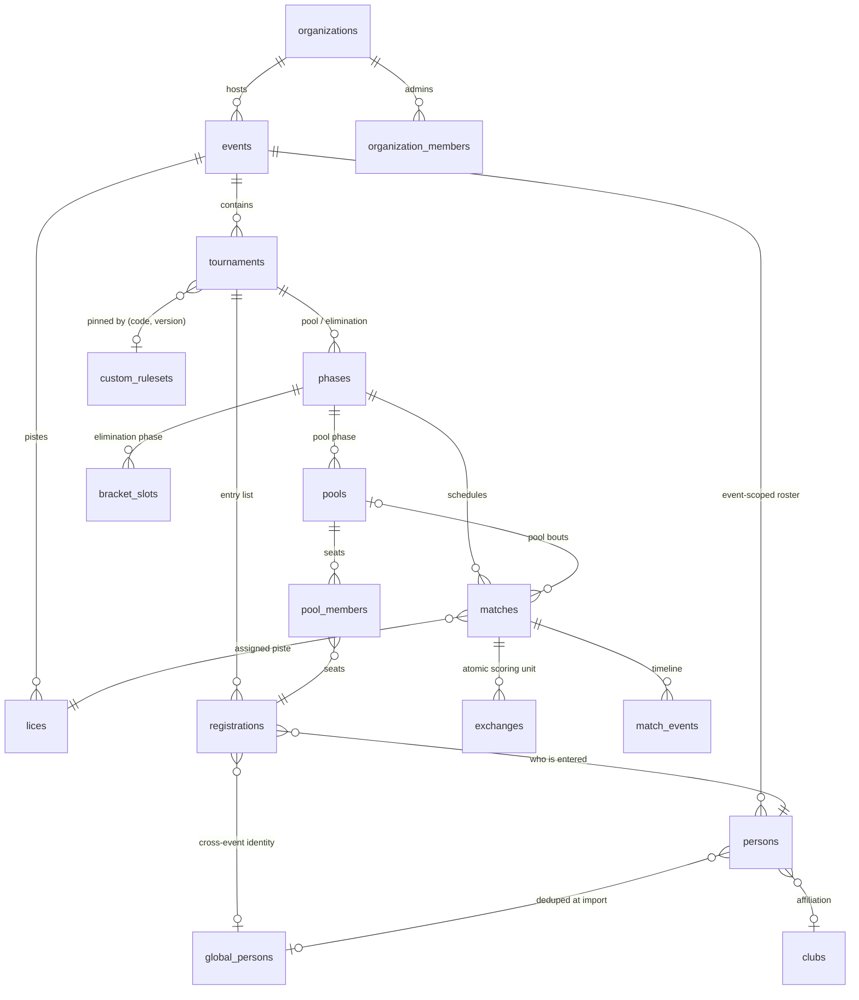

Three relationships are easy to get wrong, so they are worth stating explicitly:

- **`persons` vs `global_persons`.** `persons` is the organizer-created roster row, scoped to **one
  event**. `global_persons` is the cross-event identity a person is deduplicated onto at import. The FK
  is `persons.global_fighter_id` — the column kept its old name when the table was renamed from
  `fighters` in migration `0023`, so the name is a false friend.
- **A match hangs off a phase, not off a pool.** `matches.phase_id` is `NOT NULL` while `pool_id` and
  `bracket_slot_id` are both nullable — a pool bout carries `pool_id`, an elimination bout carries
  `bracket_slot_id`. Note `phase_id` has no FK constraint, only the `NOT NULL`.
- **The ruleset is a pin, not a join.** `tournaments` stores `ruleset_code` + `ruleset_version` as a
  _pointer_ resolved at read time, not a foreign key. That choice has real consequences — see §7bis.

### 5.2 Key tables (sketch — full DDL in `packages/db/src/schema/`)

```sql
-- Identity & multi-tenancy
organizations (id, slug, name, contact_email, status, created_at)
organization_members (organization_id, user_id, role, created_at)
users (id, email, display_name, avatar_url, locale, created_at)
                  -- mirrors auth.users, RLS-enforced
platform_roles (user_id, role)  -- super_admin override

-- Global persons (global cross-event identity)
--
-- global_persons is the cross-event aggregate for any real-world person.
-- Role flags determine which domains a person belongs to:
--   is_fighter              → competes in tournaments
--   is_referee              → qualifies as referee at events
--   is_workshop_participant → attends workshops as a participant
-- A single row covers fighter+referee overlap (common in HEMA).
--
-- Created lazily:
--   - On first fighter claim, persons.global_person_id is set to a new row (is_fighter=true).
--   - Or, an organiser creates a global profile for a referee/workshop attendee.
--   - Or, the super admin manually merges multiple persons → one row.
--
-- referee_profiles(global_person_id PK) is a 1:1 extension for referee-specific data
-- (certifications, notes). Created automatically when is_referee is set to true.
--
-- Event-scoped tables (referee_qualifications, workshop_enrollments) carry a nullable
-- global_person_id FK so event entries can be linked to the global identity over time.
-- Persons within a single event are the operational unit; global_persons are
-- the historical/cross-event unit. They MUST stay aligned via persons.global_person_id.
global_persons (
  id, slug, display_name, given_name, family_name,
  club_id, country_code,
  is_fighter, is_referee, is_workshop_participant,
  hema_ratings_id, photo_url,
  bio, date_of_birth, gender_category,
  claimed_by_user_id,  -- if a user has linked this profile
  merged_into_id, merged_at, merge_reverted_at, deleted_at,
  created_at, updated_at
)
referee_profiles (
  global_person_id PK, certifications jsonb, notes,
  created_at, updated_at
)
clubs (id, slug, name, abbreviation, city, country_code, website, logo_url, unverified)

-- Hierarchy: Organization → Event → Tournament → Phase → Match → Exchange
-- See docs/HIERARCHY.md for the canonical vocabulary.

-- Event = the gathering (e.g. "FAL 2026"). Multi-day, has venue, dates,
-- a roster of Persons, multiple Tournaments, multiple Workshops.
events (
  id, organization_id, slug, name, location, start_date, end_date,
  status,  -- draft | published | running | completed | archived
  theme_id, public_landing_md, created_at
)
themes (
  id, event_id, primary_color, secondary_color,
  accent_color, logo_url, hero_image_url,
  font_display, font_body, custom_css
)
lices (id, event_id, name, location_label, color_hex, sort_order)

-- Tournament = a competition within an event (e.g. "FAL 2026 Longsword Open").
-- One weapon, one category, one ruleset, one bracket structure.
tournaments (
  id, event_id, slug, name, weapon, category,
  ruleset_code, ruleset_version, ruleset_config,
  status, sort_order
)
registrations (
  id, tournament_id, person_id,        -- person from event roster, registered to a specific tournament
  fighter_id,                          -- nullable; populated when person.global_person_id set (references global_persons)
  seed, status,                        -- registered | checked_in | withdrawn | disqualified
  bib_number
)

phases (
  id, tournament_id, type,  -- pool | single_elim | double_elim | swiss
  sort_order, config_json,
  status,  -- pending | running | completed
  visibility_status, published_at, published_by_user_id
)
pools (id, phase_id, name, sort_order)
pool_members (pool_id, registration_id, seed)

bracket_slots (
  id, phase_id, round, position,
  source_a_type, source_a_ref,  -- e.g. winner_of(slot_id) | pool_rank(pool_id, 1)
  source_b_type, source_b_ref,
  registration_a_id, registration_b_id  -- resolved at runtime
)

swiss_rounds (
  id, phase_id, round_number,  -- UNIQUE (phase_id, round_number)
  status,  -- pending | running | completed
  bye_registration_id, pairing_meta_json
)
swiss_entrants (id, phase_id, registration_id, withdrawn_at_round)
-- matches.swiss_round_id is nullable and mutually exclusive with pool_id /
-- bracket_slot_id; see HIERARCHY.md.

Generated pool and bracket phases default to `visibility_status='hidden'`.
Organizer/admin reads can see hidden phases; public and participant-facing reads
only expose phases, pools, standings, bracket slots, and phase match details once
the phase is `published`. Existing phases were backfilled to `published` when
this visibility model was introduced.

**Swiss round lifecycle.** Three rules, each of which more than one service now
depends on:

1. `swiss_rounds.status` is a **projection of its bouts**, never a workflow of
   its own. `SwissRoundStateService.refresh` derives it and is the only writer.
   No organiser action opens or closes a round — the first fighter to step on
   the piste closes it, which is the moment a pairing change stops being an
   adjustment and becomes a rewrite of history. It runs in both directions, so
   un-completing a bout re-opens its round.
2. **Only the frontier round advances.** `planNextRound` pairs
   `rounds.length + 1`, which is "one past however many exist" and not "the one
   after this" — so closing a round that is no longer the last one would commit
   a round that skips the ones between. `SwissAdvanceService` refuses to advance
   from any round that already has a later one.
3. **A published round is never re-drawn automatically.** Committing a round
   assigns pistes and pushes `swiss_round_published` to the whole field, so
   redrawing it behind the organiser is worse than one stale pairing. Un-completing
   a bout whose round has a later round drawn is refused; an organiser may
   acknowledge and proceed, and `DELETE /swiss-phases/:id/rounds/:n` is the
   explicit remedy — it accepts exactly the last round with every bout still
   `scheduled`.

Swiss standings are derived on read and never stored, so they self-correct; the
round `status` is the only thing that can go stale, which is why rule 1 matters.

matches (
  id, phase_id, pool_id, bracket_slot_id, lice_id,
  red_registration_id, blue_registration_id,
  scheduled_at, started_at, ended_at,
  duration_active_ms, duration_total_ms,
  red_score, blue_score, winner_registration_id,
  status,  -- scheduled | running | paused | completed | voided
  scorekeeper_user_id, ruleset_code, ruleset_version,
  match_number_label  -- e.g. "L1-P3-M5"
)

match_events (
  id, match_id, sequence,
  type,  -- start | halt | resume | warning | end | reset_clock
  reason, by_user_id, occurred_at
)

exchanges (
  id, match_id, sequence,
  type,  -- clean | afterblow | double | no_exchange
  occurred_at, recorded_at, duration_since_prev_ms,
  first_striker_color,  -- 'red' | 'blue' | null (for double / no_exchange)
  first_strike_value,   -- 1 | 2 | null
  afterblow_value,      -- 1 | 2 | null (only for type='afterblow')
  no_exchange_reason,
  red_score_delta, blue_score_delta,  -- materialized for fast aggregation
  voided, voided_reason
)

-- Audit & integrity
audit_log (id, actor_user_id, action, entity_type, entity_id, payload_json, created_at)

-- Workshops (scoped to an Event, not a Tournament — workshops sit alongside
-- the competitive Tournaments inside an Event)
workshops (
  id, event_id, slug, title,
  short_description, description_md,
  language,                   -- 'en' | 'fr' | 'both'
  level,                      -- 'beginner' | 'intermediate' | 'advanced' | 'all'
  prerequisites,              -- text
  capacity,                   -- max attendees per session, NULL = unlimited
  cover_image_url,
  category,                   -- 'longsword' | 'sidesword' | 'general' | ...
  status,                     -- draft | published | cancelled
  sort_order,
  created_at, updated_at
)
workshop_instructors (
  id, workshop_id,
  fighter_id,                 -- optional FK if instructor is a known fighter
  display_name, bio, photo_url, affiliation,
  sort_order
)
workshop_sessions (
  id, workshop_id,
  starts_at, ends_at,         -- timestamptz
  location_label,             -- "Salle A", "Lice 2 (after matches)"
  lice_id,                    -- optional FK
  notes,
  status                      -- scheduled | running | completed | cancelled
)
workshop_enrollments (
  id, workshop_session_id, user_id,
  status,                     -- intent | confirmed | waitlisted | cancelled
  position,                   -- waitlist position when waitlisted
  enrolled_at, updated_at,
  UNIQUE(workshop_session_id, user_id)
)

-- Persons (canonical identity, organizer-authoritative)
--
-- Created by organizers BEFORE the event (manually or via CSV import).
-- A Person registers ONCE per event and then has zero or more registrations
-- across the Tournaments inside that event. Becomes a Referee when given
-- qualifications. The same Person can be all of these.
--
-- Identity is anchored on (event_id, email) being unique. A Person
-- can later be promoted to a global Fighter profile (cross-event)
-- when they claim their account.
persons (
  id, event_id,
  given_name, family_name, email,
  club_id,                           -- nullable, matched fuzzily on import
  hema_ratings_id,                   -- nullable, set on import or by organizer
  date_of_birth, gender_category,    -- both optional, used for category checks
  notes,                             -- organizer-only notes
  claim_status,                      -- 'unclaimed' | 'guest_active' | 'claimed'
  claimed_by_user_id,                -- nullable; set when claimed via magic link
  global_person_id,                 -- nullable; FK → global_persons(id), set when promoted to global profile
  created_by_user_id,                -- the organizer who added them
  created_at, updated_at,
  UNIQUE(event_id, email)
)

-- Guest sessions: lightweight identity for "I typed my name, picked myself"
--
-- Stored server-side and as a signed httpOnly cookie. Bound to a specific
-- person_id so the user always acts as that person, never an arbitrary one.
-- Limited capabilities (see auth section). To gain full capabilities,
-- the user must "claim" via magic link.
guest_sessions (
  id, person_id,
  device_label,                      -- "iPhone (Safari)", auto-generated
  ip_first_seen,                     -- audit only
  user_agent,                        -- audit only
  created_at, last_seen_at,
  expires_at,                        -- default: event end + 7 days
  revoked_at                         -- nullable; if organizer kicks the session
)

-- The claim event is implicit: persons.claim_status='claimed' AND claimed_by_user_id IS NOT NULL.
-- The claim mechanism is Supabase Auth magic link to the email on file.

-- Claimed-user email change workflow. A claimed participant requests a new
-- email while logged in; MyClash sends a confirmation link to the new address.
-- Confirming updates Supabase Auth email and every Person row claimed by that
-- user, after checking event-level email uniqueness.
person_email_change_requests (
  id,
  user_id,                           -- Supabase auth user id
  old_email,
  new_email,
  token_hash,                        -- SHA-256; raw token never stored
  expires_at,                        -- default: request time + 1 hour
  confirmed_at,
  cancelled_at,
  created_at,
  UNIQUE active pending request per user
)

-- Following: a user (claimed) or guest session tracks Persons within an event.
-- Event-scoped. A coach who follows Jean at FAL 2027 doesn't automatically
-- follow Jean at Swordfish 2027 — privacy preferences may differ per event,
-- and follows live alongside the per-event Person rows.
follows (
  id, event_id, followed_person_id,
  -- Exactly one of these is set (CHECK constraint):
  follower_user_id,                  -- when follower is claimed (FK auth.users)
  follower_guest_session_id,         -- when follower is a guest session (FK guest_sessions)
  notify_match_start,                -- bool, default true (claimed only — push)
  notify_workshop_start,             -- bool, default false
  notify_referee_start,              -- bool, default false
  created_at,
  CHECK (
    (follower_user_id IS NOT NULL AND follower_guest_session_id IS NULL)
    OR
    (follower_user_id IS NULL AND follower_guest_session_id IS NOT NULL)
  ),
  UNIQUE NULLS NOT DISTINCT
    (event_id, followed_person_id, follower_user_id, follower_guest_session_id)
)

-- Per-Person privacy preferences. Created lazily on first claim with defaults;
-- guest-mode persons keep the defaults.
-- Matches and referee slots are ALWAYS public — they happen in shared physical
-- space. Workshops are part of the event's shared experience and default
-- to public; users can opt out.
person_privacy (
  person_id,                         -- PK + FK to persons
  hide_workshops_publicly,           -- default false (workshops public unless opted out)
  allow_being_followed,              -- default true (person can opt out)
  show_real_email_to_followers,      -- default false; mask is shown otherwise
  updated_at
)

-- Refereeing — qualifications are event-scoped (an organizer rates referees
-- for THEIR event, separately from any other event's ratings)
referee_qualifications (
  id, user_id, event_id,
  role,                       -- 'arbitre_declarant' | 'arbitre_assesseur' | 'arbitre_table'
  rating,                     -- 1..5 (confidence/quality, NULL = unrated)
  notes,                      -- free text from organizer
  active,                     -- bool, can disable without deleting
  created_at, updated_at,
  UNIQUE(user_id, event_id, role)
)
referee_assignments (
  id, event_id, user_id,
  scope_type,                 -- 'lice' | 'pool' | 'match'
  lice_id,                    -- when scope='lice' or 'pool'
  pool_id,                    -- when scope='pool'
  match_id,                   -- when scope='match'
  role,                       -- 'arbitre_declarant' | 'arbitre_assesseur' | 'arbitre_table'
                              -- (only meaningful for pool/match scope)
  starts_at, ends_at,
  status,                     -- assigned | confirmed | declined | completed
  auto_assigned,              -- bool, was this from auto-assignment?
  conflicts_jsonb,            -- soft-conflict warnings detected at assignment time
  created_at
)

-- Pool & referee assignment settings (per event default; can be overridden per event)
pool_assignment_settings (
  id, event_id, tournament_id,           -- tournament_id NULL = event default
  enforce_school_separation,             -- bool, default true
  school_separation_strictness,          -- 'soft' | 'strict' (strict = fail if violated)
  enforce_skill_balance,                 -- bool, default true
  skill_rating_source,                   -- 'hema_ratings' | 'manual' | 'seed_only'
  enforce_referee_no_back_to_back,       -- bool, default true
  referee_rest_min_slots,                -- int, default 1 (skip ≥1 pool slot between duties)
  enforce_dedicated_referee_rest,        -- bool, default true (apply rest to non-fighters too)
  enforce_fighter_referee_no_overlap,    -- bool, MUST be true (hard constraint)
  prefer_high_rated_referees,            -- bool, default true (sort candidates by rating desc)
  created_at, updated_at
)

-- Push notifications
push_subscriptions (
  id, user_id,
  endpoint, p256dh_key, auth_key,
  user_agent, created_at, last_seen_at
)
notification_preferences (
  user_id,
  match_starting_minutes_before,    -- e.g. 10
  workshop_starting_minutes_before, -- e.g. 15
  referee_starting_minutes_before,  -- e.g. 10
  schedule_changes,                 -- bool
  results_published,                -- bool
  enabled
)
event_broadcast_notifications (
  id, event_id, actor_user_id,
  severity, target_type, title, body,
  recipient_count, created_at
)
event_broadcast_recipients (
  id, broadcast_id, person_id, user_id, email,
  delivery_status, delivered_at, error, created_at
)
```

This sketch is **non-exhaustive** — it predates several shipped feature waves. Other significant table families in `packages/db/src/schema/` (and their migrations) include:

- **Leagues / Classement** — `leagues`, `league_organization_roles`, `league_user_roles`, plus league–tournament links, membership requests, groups and scoring systems (migrations `0015_leagues.sql`, `0069_league_membership_requests.sql`, and later). Cross-event standings aggregated from linked tournaments.
- **Directory groups (People Hub)** — `directory_groups`, `directory_group_members` (migration `0114_directory_groups.sql`). User-curated groups of global persons for the `/me` people hub.
- **AI subsystem** — organization-level AI provider settings, usage/budget tracking, organizer chatbot, and generated content: `generated_content` (migration `0119_generated_content.sql`) plus `fighter_ai_settings` (migration `0120_fighter_ai_settings.sql`) for fighter self-service AI, alongside the AI provider/usage tables (migrations `0115`–`0118`).
- **Referee compensation** — see §13 (migration `0027_referee_compensation.sql`).

### 5.3 Exchange semantics

The `exchanges` table is the single source of truth. The match score is **always derived** from non-voided exchanges; never stored independently. This guarantees the score is consistent with the visible exchange list and statistics computations.

**Type meanings:**

| `type`        | Meaning                                      | Score effect (TF_v1)                                                       |
| ------------- | -------------------------------------------- | -------------------------------------------------------------------------- |
| `clean`       | One fighter struck, no afterblow             | first striker gains `first_strike_value`; opponent +0                      |
| `afterblow`   | First strike, then retaliation within window | first striker gains `first_strike_value`; opponent gains `afterblow_value` |
| `double`      | Both struck simultaneously                   | neither gains points; counted toward double penalty                        |
| `no_exchange` | Halt, off-target, warning, etc.              | no score effect                                                            |

**Statistics columns derivation** (matching the lyonamhe.fr layout):

For fighter F in event E:

- `Dbl` = count(exchanges where match involves F and type='double')
- `✓1` = count(type='clean', first_striker=F, first_strike_value=1)
- `✓1-1` = count(type='afterblow', first_striker=F, first_strike_value=1)
- `✓2`, `✓2-1` analogous for value=2
- `✗1` = count(type='clean', first_striker=opponent_of(F), first_strike_value=1)
- `✗1-1` = count(type='afterblow', first_striker=opponent_of(F), first_strike_value=1) — F received afterblow opportunity? **NO** — `✗1-1` means F received first hit AND landed afterblow. Re-checking source page legend: "✗ indicates that the combatant received the first touch". So `✗1-1` = F was hit first (1pt) and F landed afterblow. = count(type='afterblow', first_striker=opponent_of(F), first_strike_value=1). The afterblow_value is F's afterblow; that's what makes the row.
- `Total` = sum of all above
- `Ratio` = Dbl / Total

**Current implementation (migration 0128): computed on-read** via the `fighter_exchange_stats(tournament_id)` Postgres function, scoped to one tournament. (The original `mv_fighter_exchange_stats` materialized view was dropped: its refresh trigger only `pg_notify`'d a channel with no listener, so it served stale data; the on-read function is always fresh and nets afterblow points correctly for both scoring modes.)

### 5.4 Match-level statistics (timing)

From `match_events` and `exchanges`:

- **Match duration (active)**: sum of intervals between `start`/`resume` and `halt`/`end`. Persisted as `matches.duration_active_ms` when the `end` clock action fires.
- **Match duration (total)**: `ended_at - started_at`. Persisted as `matches.duration_total_ms` when the `end` clock action fires.
- **Judging overhead**: `duration_total_ms − duration_active_ms` — time spent outside active fighting (deliberation, cards, border calls). Available to organisers via the match list (`GET /api/v1/matches?phaseId=...`).
- **Time between exchanges**: `exchanges.duration_since_prev_ms`, computed at insert.
- **Currently running matches**: `matches WHERE status='running'`, indexed for the live view.

The scoring pad displays both the active fight clock and a secondary "Temps total" wall-clock elapsed timer that ticks continuously once a match starts (including during halts), giving referees real-time awareness of judging pace.

### 5.5 Lifecycle state machines

> **What is actually enforced.** The `CHECK` constraints below restrict the _set of legal values_; they
> do not constrain transitions. Nor does the service layer — `MatchesService.updateStatus` writes
> whichever legal value it is handed and only attaches side effects (`started_at` on `running`,
> `ended_at` + winner on `completed`). The diagrams therefore describe the **intended** lifecycle, which
> is a convention the API and UI follow, not an invariant the system guarantees.
>
> `tournaments.status` is looser still: it has **no `CHECK` constraint at all**, as noted in migration
> `0138`. Its values (`draft`, `published`, `running`, `completed`) exist only in application code.

**Event** — the organiser-facing publish flow. `archived` is reachable from any state (an event can be
shelved before it ever runs).

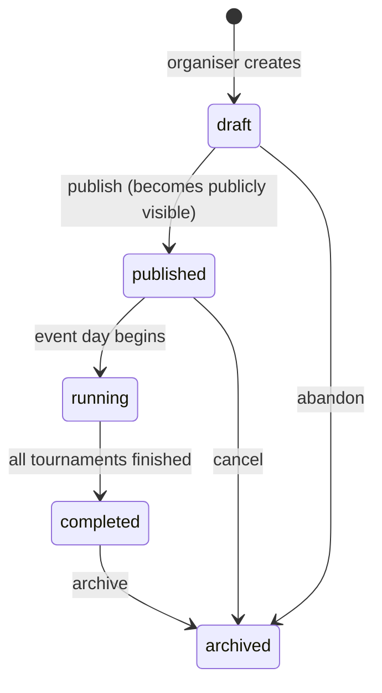

**Match** — the scoring flow. `paused` is a halt (deliberation, cards, border calls) and returns to
`running`; `voided` annuls a bout without deleting it, preserving its exchanges.

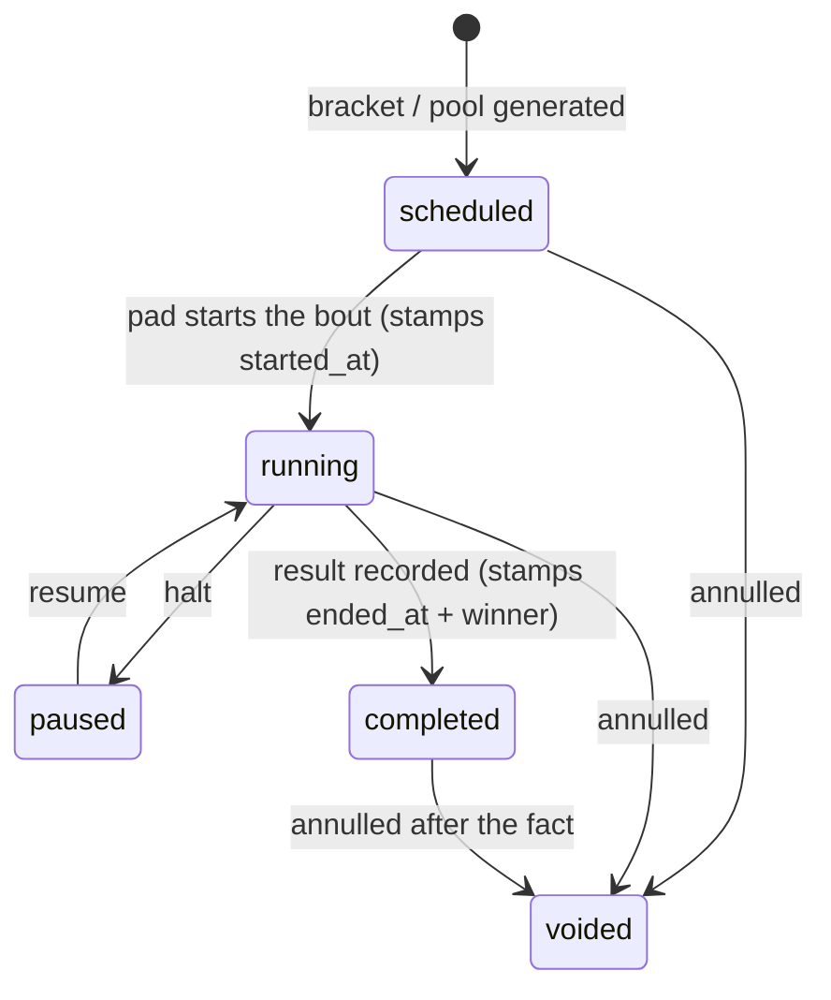

**Registration** — a fighter's entry in one tournament.

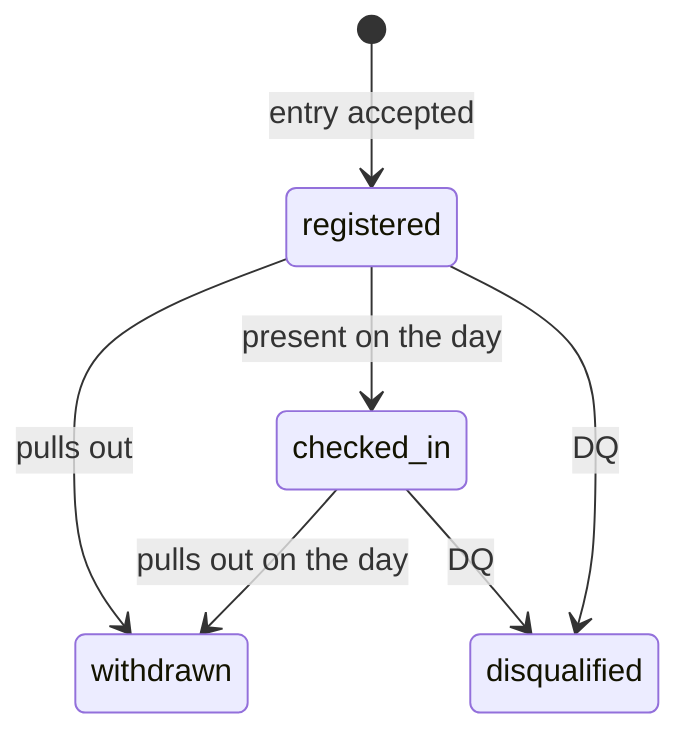

The remaining status columns follow the same shape and are not drawn separately:

| Table                  | States                                                     |
| ---------------------- | ---------------------------------------------------------- |
| `workshops`            | `draft → published → running → completed`                  |
| `workshop_sessions`    | `scheduled → running → completed`, `cancelled`             |
| `workshop_enrollments` | `intent → confirmed`, `waitlisted`, `cancelled`, `refused` |
| `leagues`              | `draft → published → archived`                             |
| `organizations`        | `active`, `suspended`                                      |
| `event_staff_accounts` | `active`, `disabled`                                       |

Every request/approval table — `exchange_edit_requests`, `deletion_requests`,
`global_person_claim_requests`, `league_membership_requests`, `league_tournament_links`,
`tournament_penalty_reviews` — shares a trivial `pending → approved | rejected` shape (with
`withdrawn`/`removed`/`dismissed` variants), so none is drawn.

---

## 6. TF_v1 Ruleset Specification

This is the canonical ruleset shipped with MyClash.

### 6.1 Per-fighter aggregates

For fighter F in pool/event:

```
wins(F)              = count of matches where winner_registration_id = F
target_points(F)     = Σ first_strike_value where F was first striker (clean OR afterblow)
                     + Σ afterblow_value     where F landed afterblow
times_hit(F)         = count of clean exchanges where F was the receiver
                     + count of afterblow exchanges where F received the afterblow
                       (NOTE: in afterblow, the FIRST striker receives the afterblow)
doubles(F)           = count of double exchanges in F's matches
n_doubles(F)         = doubles(F)
```

### 6.2 Score formula

```
WIN_BONUS         = 3
DOUBLE_PENALTY(n) = n * (n - 1) / 3        -- a(n) = n(n-1)/3, n = total doubles
SCORE(F)          = (wins(F) * WIN_BONUS + target_points(F))
                  / (times_hit(F) + DOUBLE_PENALTY(n_doubles(F)))
```

**Edge cases:**

- If denominator = 0 (no hits received, no doubles): SCORE = numerator (treat as if denominator = 1). Document this explicitly.
- Score is rounded to 1 decimal for display, but stored as full precision.

### 6.3 Ranking & tiebreakers

Sort fighters by:

1. `SCORE(F)` descending
2. `wins(F)` descending
3. `doubles(F)` ascending
4. `times_hit(F)` ascending
5. Stable: `registration.seed` ascending (or `bib_number` as fallback)

### 6.4 Cross-check with reference page

Spot-checked against `https://lyonamhe.fr/resultat_fal2026.html` Pool ranking, e.g.:

> Thibaud Jacquier-Bret: V=4, Pts+=37, Pts−=10, Dbl=2, Score=4.6
> SCORE = (4 × 3 + 37) / (10 + 2×1/3) = 49 / 10.67 = 4.59 ≈ **4.6** ✓

Implementation must reproduce these scores byte-for-byte.

### 6.5 Configurable parameters (in `events.ruleset_config`)

```json
{
  "win_bonus": 3,
  "afterblow_window_ms": 1000,
  "target_values": {
    "deep_target": 2,
    "shallow_target": 1
  },
  "match_format": {
    "first_to_points": null,
    "time_limit_seconds": 180,
    "max_doubles": 3
  },
  "double_penalty_formula": "n*(n-1)/3"
}
```

`double_penalty_formula` is a whitelisted expression key; the engine maps it to a server function (no `eval`).

Forfeits are ruleset behavior, not fake exchanges. TF/FFAMHE defaults are: injury keeps current points and asks whether the fighter can continue; voluntary and first black card award a 0-6 loss and ask whether the fighter can continue; second black card and conduct/violence award a 0-6 loss and disqualify the registration. Active forfeits are stored in `match_forfeits`, drive `matches.status/winner_registration_id`, and may be voided only before downstream dependent matches start. In pools, `canContinue=false` auto-forfeits later unstarted pool matches. In brackets, play-ins and round 2+ become walkovers; main bracket round 1 can replace an unstarted forfeiting fighter with the next eligible pool-ranked non-qualifier.

---

## 7. Scoring Engine & Ruleset Plugin System

### 7.1 Plugin contract (TypeScript)

```ts
// packages/rulesets/src/types.ts
export interface Ruleset {
  code: string; // "TF_v1"
  version: string; // "1.0.0"
  displayName: string;
  configSchema: ZodSchema; // for validating ruleset_config

  /** Compute one match's score from its exchanges */
  computeMatchScore(match: Match, exchanges: Exchange[], config: unknown): MatchScore;

  /** Decide if a match has ended (first-to-N, time-out, max-doubles, etc.) */
  isMatchOver(
    match: Match,
    exchanges: Exchange[],
    clockMs: number,
    config: unknown,
  ): MatchEndDecision;

  /** Compute pool standings from all matches */
  computePoolStandings(
    pool: Pool,
    matches: Match[],
    registrations: Registration[],
    config: unknown,
  ): PoolStandingRow[];

  /** Optional: compute event-level final ranking from pool + elim phases */
  computeFinalRanking?(event: Event, phases: Phase[], config: unknown): FinalRankingRow[];
}
```

### 7.2 Built-in rulesets shipped at v1.0

- **TF_v1** — the canonical ruleset spec'd in §6.
- **Generic_PointsCap** — first-to-N points, no algorithm score (for clubs that just want simple pool play).

(These two are the only rulesets registered today; see `packages/rulesets/src/index.ts`. Data-driven `FormulaRuleset` variants are also supported via the registry.)

Additional rulesets are added by:

1. Implementing the contract in `packages/rulesets/src/<code>.ts`.
2. Registering it in the ruleset registry.
3. Super Admin approval (DB row in `rulesets` table marks it `published`).

### 7.3 Where the engine runs

- **Server side (NestJS)** — authoritative. All persisted scores, standings, and rankings are computed server-side.
- **Client side (Web Worker)** — same module, used for instant UI feedback during scoring (optimistic) and for the offline scoring app. The shared package is published as `@myclash/rulesets`.

This dual-runtime design is critical for the offline scoring tablet.

---

## 7bis. Ruleset authoring, sharing and pinning

§6 specifies the TF_v1 format and §7 the engine that executes a ruleset. This section covers the
**self-service lifecycle** around them: how an organisation authors its own ruleset, how one becomes
visible to other organisations, and what it means for a tournament to "use" one.

### 7bis.1 Two orthogonal axes

The most common misreading is that submitting a ruleset for review is a _status_. It is not.
`custom_rulesets.status` (`draft | published | archived`) and its sharing state are carried by
**separate columns**, added in migration `0055`:

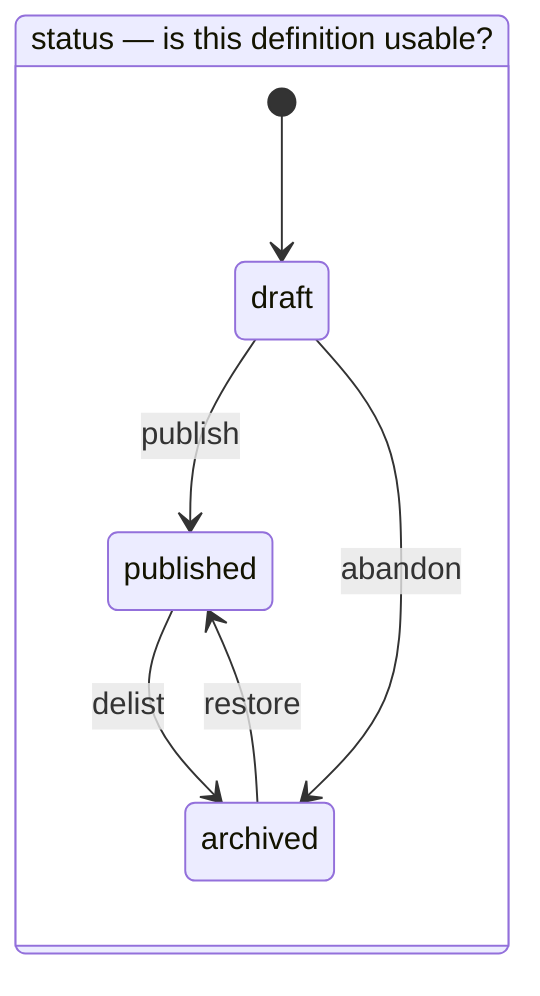

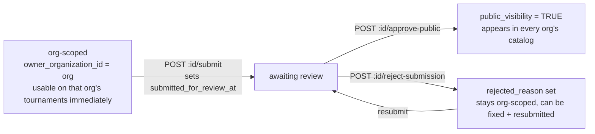

The practical consequence: **an organisation never waits for approval to use its own ruleset.** Review
governs only whether the ruleset appears in the platform-wide catalog for _other_ organisations.
`owner_organization_id IS NULL` denotes a platform-level ruleset.

> `ruleset_submissions` is a **dead table**. It survives in the schema and in the GDPR export table list,
> but no ruleset code path reads or writes it — `submitted_for_review_at` is the only submission route.

### 7bis.2 Two authoring paths

| Path           | Storage                      | Resolves as                                               |
| -------------- | ---------------------------- | --------------------------------------------------------- |
| **Formula**    | `score_formula` (AST)        | a `FormulaRuleset` built from the stored grammar          |
| **Coded fork** | `base_code` + `base_version` | short-circuits to `registry.get(base_code, base_version)` |

The coded fork exists because TF*v1's ranking (score, then wins, doubles, timesHit, seed) is an
algorithm, not an expression — re-authoring it as a formula AST is explicitly ruled out, since the DSL
cannot carry its tiebreak chain. A fork that wants TF_v1's **maths** with different **parameters**
therefore keeps pointing at the coded engine while supplying its own config. `base_version` pins \_which*
coded version the fork tracks, so a later TF_v1@2.0.0 cannot silently change a fork of 1.0.0.

### 7bis.3 A pin is a pointer, resolved at read time

`tournaments.ruleset_code` + `ruleset_version` is a **pointer**, not a foreign key. Standings resolve it
on every read, which is the single most important consequence in this section: **changing the pointer
re-ranks results that are already recorded.**

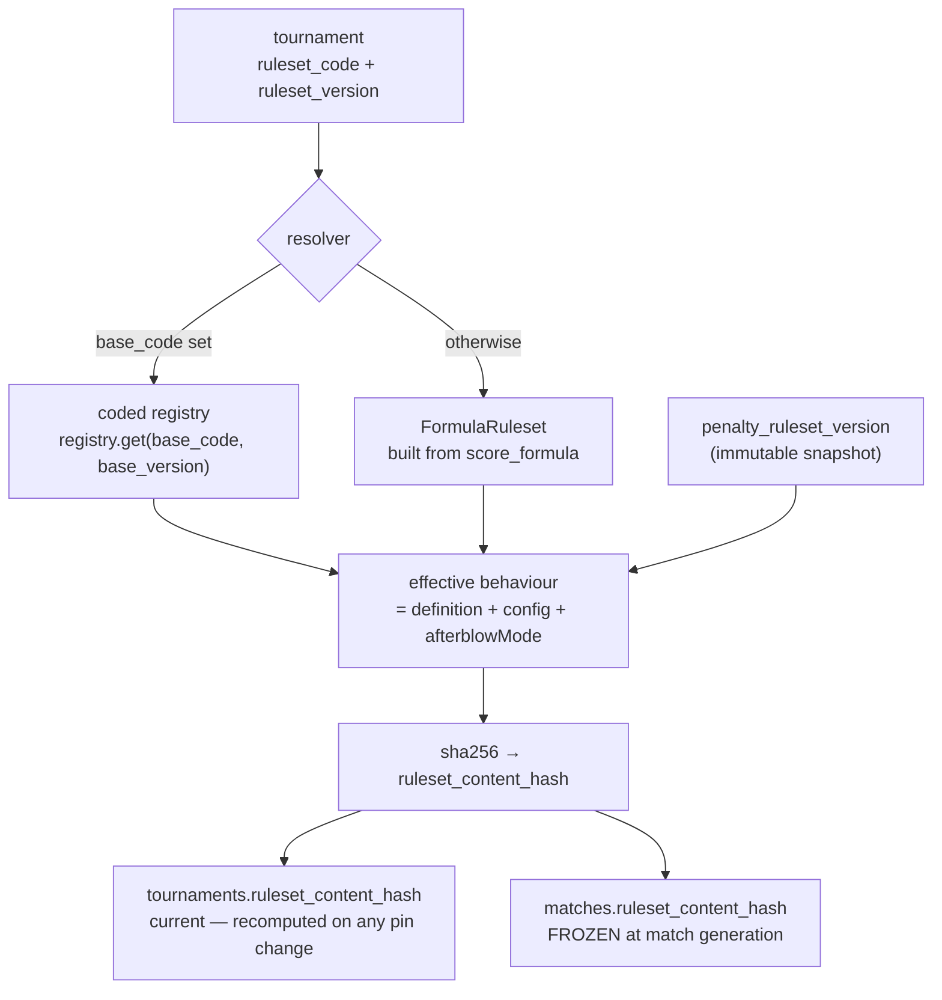

`(code, version)` identifies the _definition_; the content hash identifies the _effective behaviour_.
Two TF_v1 tournaments with different `winBonus` resolve to the same engine but hash differently. The
match-level copy is frozen when the match is generated, so a scored match permanently records which
behaviour produced it.

Because a live pointer change rewrites recorded standings, mid-event re-pinning is not a plain update —
it is an audited ceremony (typed confirmation, mandatory justification, org-owner or super-admin,
blocked on completed/archived tournaments). `tournament_ruleset_repins` is its append-only record:
actor, from → to, the per-bucket diff, whether ranking stayed compatible, and the materialised
before/after placings.

### 7bis.4 Immutability and delisting

Two rules keep a pinned definition from shifting under a tournament:

- **Versions are snapshotted.** Publishing captures the payload immutably (`custom_ruleset_versions` for
  scoring, `penalty_ruleset_versions` for penalties). Rollback copies a snapshot back onto the parent
  rather than overwriting destructively. `is_frozen` flips `TRUE` the moment a tournament pins the
  ruleset, after which the edit-guard refuses further edits.
- **Delist ≠ delete.** Deleting a ruleset that any tournament pins would 400 that tournament's
  standings, so the service **soft-archives** it instead: the row leaves every picker and list but stays
  resolvable forever. Only an unreferenced ruleset is truly deleted. System and default rulesets cannot
  be deleted at all.

### 7bis.5 Endpoint surface

| Actor            | Endpoints                                                                                                                                                                               |
| ---------------- | --------------------------------------------------------------------------------------------------------------------------------------------------------------------------------------- |
| **Organisation** | `GET catalog` · `POST fork` · `POST validate` · `PATCH :id` · `DELETE :id` (soft-archives if referenced) · `POST :id/submit` · `GET :id/export` · `POST import`                         |
| **Super admin**  | `POST :id/publish` / `:id/unpublish` · `GET :id/versions` · `POST :id/versions/:versionId/rollback` · `POST :id/set-default` · `POST :id/approve-public` · `POST :id/reject-submission` |

---

## 8. Statistics Module

### 8.1 What we display (mirroring lyonamhe.fr layout)

**Event-level hero numbers:**

- Total participants
- Total matches
- Doubles rate (%)
- Number of events
- Number of clubs

**Per-event:**

- Podium (top 3 with photos)
- Final classification table
- Pool phase classification (V / Pts+ / Pts− / Dbl / Score)
- Charts:
  - Distribution of exchanges (clean / afterblow / double, stacked)
  - Exchanges by weapon (if multi-event)
  - Target zones (1pt vs 2pt distribution)
  - Evolution of double rate over the day (line chart, X = match index, Y = doubles%)
  - Top 5 "Deep Target Hunters" (most 2pt hits)
- Per-fighter detailed exchange table (Dbl / ✓1 / ✓1-1 / ✓2 / ✓2-1 / ✗1 / ✗1-1 / ✗2 / ✗2-1 / Total / Ratio)

**Special awards:**

- Prix Technique (judge-decided, not computed)

### 8.2 Computation strategy

- **Hot path (live)**: realtime updates push deltas; UI maintains incremental aggregates.
- **Per-fighter exchange aggregates**: computed on-read by the `fighter_exchange_stats(tournament_id)` Postgres function (migration 0128) — always fresh, no materialization/refresh. (Superseded the `mv_fighter_exchange_stats` materialized view from `0010`/`0110`/`0113`, which went stale because its refresh trigger had no listener.)
- Event- and tournament-level aggregates are served from plain `vw_tournament_query_*` views (fighters, pools, matches, exchange summary, referees), not a materialized event summary.
- Public stats page reads these views directly (fast).

### 8.3 Export formats

- **HTML** — static page, like the reference, generated server-side.
- **PDF** — via Puppeteer in the worker.
- **CSV** — full match + exchange dump.
- **JSON** — full event data (for archival, HEMA Ratings submission).
- **HEMA Ratings format** — see §11.

---

## 9. Real-Time Architecture

### 9.1 What is broadcast

| Channel                | Payload                                                    | Subscribers                             |
| ---------------------- | ---------------------------------------------------------- | --------------------------------------- |
| `event:{id}`           | high-level events (match started, ended, podium published) | public app, admin                       |
| `event:{id}:standings` | pool standings deltas                                      | public app, admin                       |
| `lice:{id}:current`    | current/next match on a Lice                               | public app, admin, accompanist views    |
| `match:{id}:exchanges` | new exchange, voided exchange, score update                | public app, scorekeeper (other devices) |
| `match:{id}:clock`     | clock state changes                                        | public app, scorekeeper                 |

### 9.2 Mechanism

- **Read-side**: clients subscribe via Supabase Realtime. Postgres `LISTEN/NOTIFY` on row changes (`exchanges`, `matches`, `match_events`) is bridged to clients with sub-second latency. RLS policies filter what each user sees.
- **Write-side**: clients write through NestJS, which writes to Postgres in a transaction. The realtime broadcast is a side-effect of the row change, not a separate publish step. This makes "what's broadcast" and "what's persisted" trivially consistent.

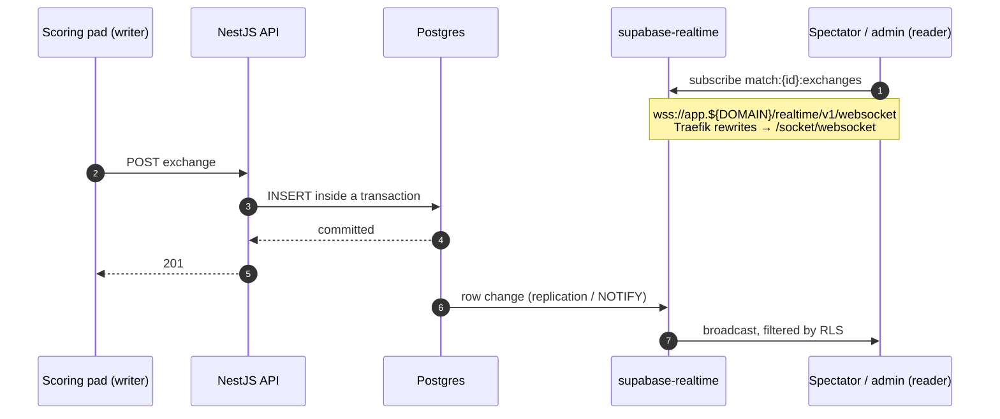

There is **no publish call anywhere in the API** — step 6 happens because the row changed. That is the
property worth protecting: a code path cannot broadcast something it failed to persist, or persist
something it forgot to broadcast. It also means a write that rolls back is never seen by subscribers.

### 9.3 Backpressure

Per-channel rate limit on the Realtime side (Supabase config). Clients debounce UI updates to ≤30 fps.

---

## 10. Offline-First Scoring (PWA + IndexedDB)

### 10.1 Why this is non-negotiable

HEMA events happen in sports halls, basements, and convention centers with hostile wifi. If the scorekeeper's tablet drops connection mid-match and the app stops working, the entire event jams up. Offline-first is **the** quality bar for the scoring app.

### 10.2 Architecture

Implemented in [`apps/web-staff/src/offline/`](../apps/web-staff/src/offline/) — `db.ts` (Dexie
schema: `outbox` + `synced`), `outbox.ts`, `sync.ts` (`SyncEngine`), `reconcile.ts`.

The write is **durable-first**: the exchange lands in the IndexedDB outbox before any network call, so
closing the tab or losing wifi mid-bout cannot lose it.

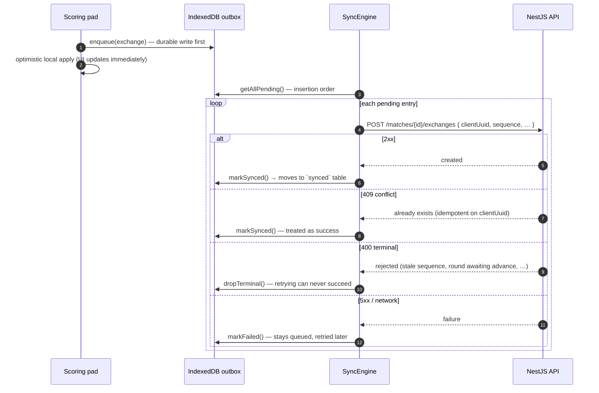

The `clientUuid` is what makes the retry safe: the server keys idempotency on it, so a duplicate POST
after a flaky response is a no-op rather than a double-scored exchange.

**Sync status**, surfaced prominently on the pad (`SyncStatus` in `sync.ts`):

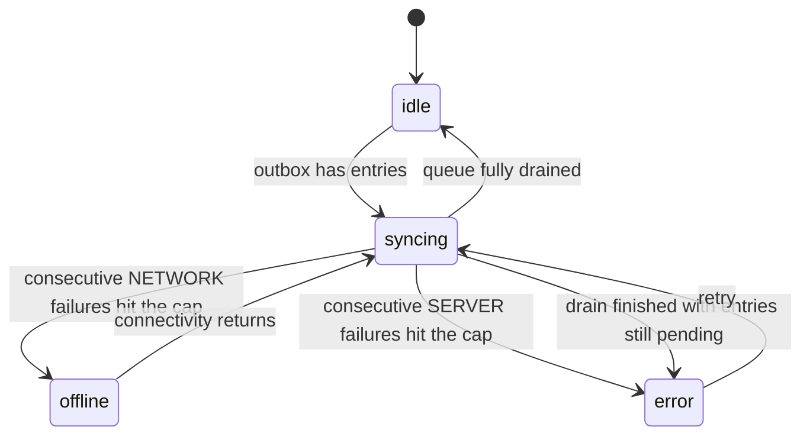

The split between `offline` and `error` is deliberate: a network failure means "keep waiting, this will
resolve", whereas a server failure means "something needs a human". Both leave the exchanges queued.

> One behaviour worth knowing at the pad: a **400 is terminal** — the entry is dropped from the outbox
> with a console warning rather than retried, because retrying a stale sequence or a round awaiting
> advance can never succeed and would block the whole queue behind it.

### 10.3 Conflict resolution

- Each exchange carries a **client-generated UUID** (`exchange_id`) and a monotonic **client sequence number**.
- Server is idempotent: inserting an exchange with an existing UUID is a no-op.
- If server has a newer exchange list (e.g. another scorekeeper edited via admin), the local app reconciles by replaying server state and re-applying any local pending exchanges. Since exchanges are append-only with explicit sequence, conflicts are bounded.
- **Voids** are never destructive: a voided exchange remains in the table with `voided=true`. Replays do not lose data.

### 10.4 PWA requirements

- Service Worker pre-caches the scoring app shell + the ruleset bundle.
- Manifest installs as standalone tablet app.
- The app must explicitly indicate its sync status prominently — the scorekeeper must always know. The implemented states are `idle | syncing | offline | error` (see the state machine in §10.2).

---

## 11. HEMA Ratings Integration

### 11.1 Scope (v1)

**Pull-only.** MyClash periodically syncs from HEMA Ratings:

- Fighter index (name, club, country, current rating).
- Allows organizers to **link** a MyClash fighter profile to a HEMA Ratings ID at registration time.
- Surface current rating on fighter profiles and in admin registration UI ("this fighter is rated 1450 longsword").

### 11.2 Mechanism

- Daily BullMQ cron job pulls the public dataset.
- Stored in `hema_ratings_snapshots` with timestamp.
- `fighters.hema_ratings_id` is the canonical link.
- Search: full-text search on the latest snapshot to suggest matches when registering.

### 11.3 Export format (for organizers to manually submit)

A "HEMA Ratings export" button on the event page produces a CSV / JSON in the format HEMA Ratings curators expect (to be confirmed with them). Schema:

```json
{
  "event": { "name": "...", "date": "...", "location": "..." },
  "event": { "weapon": "longsword", "category": "open" },
  "matches": [
    {
      "red": { "name": "...", "hema_ratings_id": "..." },
      "blue": { "name": "...", "hema_ratings_id": "..." },
      "phase": "pool" | "elimination",
      "winner": "red" | "blue" | "double_out",
      "red_score": 7, "blue_score": 5
    }
  ]
}
```

### 11.4 Future (v2+)

Direct API push if/when HEMA Ratings exposes one.

---

## 11bis. Workshops Module

### 11bis.1 Concept

Many HEMA events run **workshops in parallel** with the competition (technique, source study, conditioning, judging seminars). MyClash treats workshops as first-class entities, not as bolted-on schedule items.

A user can be a **competitor** AND a **workshop attendee** AND a **referee** at the same event — these personas are non-exclusive.

### 11bis.2 Domain model

- **Workshop** = the thing being taught (title, description, instructor, level, language, capacity, category).
- **WorkshopSession** = a concrete time-and-place instance. A single Workshop can have multiple sessions (Saturday 10:00 AND Sunday 14:00).
- **WorkshopEnrollment** = a user's intent to attend a session. Capacity-managed: when full, new enrollments go to waitlist.

### 11bis.3 Schedule conflict detection

When a user views their **My Schedule**, the system computes their personal schedule items in priority order:

1. **Match assignments** (as competitor) — hard, cannot reschedule.
2. **Referee assignments** — hard, cannot reschedule.
3. **Workshop enrollments** — soft, user choice.

For any pair `(item_a, item_b)` where time ranges overlap, the UI flags a **conflict**. Workshops are flagged with explicit "Conflicts with Match #L1-P3-M5" annotations. The user can:

- Cancel the workshop enrollment.
- Acknowledge the conflict (warning persists, but user proceeds).

**Schedule resolution algorithm (server side):**

```ts
async function getUserSchedule(userId: string, eventId: string): Promise<ScheduleItem[]> {
  const matches = await getCompetitorMatches(userId, eventId);
  const refereeAssgs = await getRefereeAssignments(userId, eventId);
  const workshops = await getEnrolledWorkshopSessions(userId, eventId);

  const items: ScheduleItem[] = [
    ...matches.map(toScheduleItem),
    ...refereeAssgs.map(toScheduleItem),
    ...workshops.map(toScheduleItem),
  ];

  // Annotate conflicts: any two items with overlapping [starts_at, ends_at]
  for (const a of items)
    for (const b of items) {
      if (a.id !== b.id && rangesOverlap(a, b)) {
        a.conflicts.push(b.id);
      }
    }

  return items.sort(byStartTime);
}
```

Match times for conflict detection use a **buffer** (e.g. ±15 min) since match start times are estimates.

### 11bis.4 Capacity management

- `workshops.capacity` = max attendees per session (NULL = unlimited).
- New enrollment when seats remain → `status='confirmed'`.
- New enrollment when full → `status='waitlisted'` with `position=N`.
- When a confirmed enrollment cancels → top of waitlist auto-promotes (BullMQ job, sends notification).
- Organizer can manually promote/demote.

### 11bis.5 Public discovery

- `/e/[eventSlug]/workshops` — browsable workshop catalog with filters (day, category, language, level, instructor).
- Workshop detail page with description, instructor bio, sessions, "Add to my schedule" button.
- Anonymous browsing allowed; enrollment requires login.

### 11bis.6 Organizer admin

- Admin UI for creating workshops, adding instructors, scheduling sessions.
- Drag-drop session scheduler showing Lices + venue rooms in a single timeline.
- Roster view per session (confirmed, waitlisted), with check-in.
- Cancel session → all enrollees notified (push + email).

---

## 11ter. Push Notifications

### 11ter.1 Scope (v1)

Web Push (VAPID), no native app. Users opt in from their profile screen. Preferences stored in `notification_preferences`.

### 11ter.2 Triggers

| Event                               | Default lead time | Toggleable |
| ----------------------------------- | ----------------- | ---------- |
| Your match starts                   | 10 min before     | yes        |
| Your refereeing slot starts         | 10 min before     | yes        |
| Your workshop starts                | 15 min before     | yes        |
| Your match assignment changed       | immediate         | yes        |
| Workshop you enrolled in cancelled  | immediate         | always on  |
| Promoted from waitlist to confirmed | immediate         | always on  |
| Final results published             | immediate         | yes        |
| Organizer event broadcast           | immediate         | global     |

### 11ter.3 Implementation

- BullMQ scheduled jobs ("delayed jobs") created when a match/session schedule changes.
- Job picks the user's `push_subscriptions`, sends via `web-push` library with VAPID keys.
- Offline-tolerant: if a user's device is offline, the push is queued by the OS; delivered on reconnect.
- Falls back to email for users with `enabled=false` for push but who opted in to email.
- Organizers can send event-scoped broadcasts with severity `info`, `warning`, or `alert` to all event Persons, fighters, referees, fighters+referees, or selected Persons. Broadcasts persist in `event_broadcast_notifications` and `event_broadcast_recipients`; claimed users get push first, while unclaimed/no-push recipients receive email fallback.
- Broadcasts may include `tournamentId` for tournament-scoped fighter/referee targeting. Pool/bracket publish flows use this to open editable "ready" notification drafts without auto-sending.

---

## 11quater. Pool Population & Referee Assignment

This is a v1 feature. The organizer admin gets two assistant tools — pool populator and referee assigner — both **constraint-driven and configurable**, both producing **assignments + a feasibility report** so the organizer always knows what worked, what failed, and why.

### 11quater.1 Pool Populator

**Inputs:**

- A registered fighter list for an event.
- Pool count (or target pool size).
- `pool_assignment_settings` for this event.

**Hard constraints** (always enforced):

- Pool sizes balanced within ±1 fighter.

**Soft constraints** (configurable, weighted in cost function):

- **School separation** — fighters from the same `club_id` distributed across pools. Cost increases per same-club pair in the same pool.
- **Skill balance** — high-rated fighters spread evenly. The "skill" of a fighter for an event is computed as:
  1. HEMA Ratings score for the **event's weapon**, if linked and not stale (<2 years old).
  2. Otherwise: HEMA Ratings overall rating.
  3. Otherwise: registration `seed`.
  4. Otherwise: registration order.
     Pools should have similar mean rating; cost increases with mean-rating variance across pools.

**Algorithm (greedy + local search):**

```
1. Sort fighters by skill (descending), unrated last.
2. Snake-distribute to pools: pool 1 gets seed 1, pool 2 seed 2, ..., pool N seed N,
   then pool N seed N+1, pool N-1 seed N+2 ... (zig-zag).
3. Iterate K = max(50, fighters * 2) times:
   - Pick a random pair of fighters in different pools.
   - If swapping them reduces total cost (school + skill terms), accept.
4. Return assignment + cost report.
```

This produces near-optimal results in practice without needing a CP-SAT solver. For very small pool counts (≤2) where school separation is impossible, the cost function reports unavoidable violations to the organizer.

**Output:**

- Pool assignments.
- A **feasibility report**:
  - Same-club pairs in each pool (count + names).
  - Skill variance across pools.
  - Whether each soft constraint was fully satisfied.
- The organizer can: accept, manually override (drag fighter between pools — cost recomputes live), or regenerate with different settings.

### 11quater.2 Referee Assignment

The hardest piece. Each pool requires **3 referees**, one per role:

| Role (canonical code) | French display    | English gloss                            |
| --------------------- | ----------------- | ---------------------------------------- |
| `arbitre_declarant`   | Arbitre déclarant | Lead/Director referee                    |
| `arbitre_assesseur`   | Arbitre assesseur | Assessor referee                         |
| `arbitre_table`       | Arbitre de table  | Table referee (timing/scoring oversight) |

A user has zero or more `referee_qualifications` rows per event. A user qualified for a role with `rating=5` is highly trusted; `rating=1` means novice. Some users are qualified for all three roles, some for one.

**Inputs:**

- The pool schedule (every `(pool_id, lice_id, starts_at, ends_at)` tuple).
- The event's match schedule (so we know when each fighter is on the piste).
- All `referee_qualifications` for the event.
- All workshop enrollments per user (soft conflict).
- `pool_assignment_settings`.

**Hard constraints** (assignment is rejected if violated):

- A fighter cannot referee a pool whose time overlaps with a match they're fighting in. (`enforce_fighter_referee_no_overlap`)
- A user must hold an active `referee_qualifications` row for the role being assigned.

**Soft constraints** (cost function, configurable on/off):

- **No back-to-back referee duties.** If `enforce_referee_no_back_to_back=true`, assigning the same user to two consecutive pool slots on the same Lice incurs high cost. `referee_rest_min_slots` controls the gap (default 1).
- **Dedicated referee rest.** Same constraint applies even to users with no fighter registration, when `enforce_dedicated_referee_rest=true`.
- **Workshop conflict.** If the user has a confirmed workshop session in the same time window, cost increases (warning, not rejection).
- **Prefer high-rated referees.** When `prefer_high_rated_referees=true`, candidates are sorted by `rating` descending before being assigned.
- **Workload balance.** Across the event, distribute refereeing duties evenly among qualified users.

**Algorithm (greedy with backtracking):**

```
1. Build the schedule grid: list of (pool_id, role, slot_start, slot_end) cells.
2. Sort cells by constraint tightness (fewest eligible candidates first).
3. For each cell:
   a. Get candidates: users with active qualification for this role.
   b. Filter HARD-conflicted candidates (fighter in this pool's matches at this time).
   c. Score remaining candidates:
        score = rating_weight * rating
              - back_to_back_penalty (if assigned to adjacent slot)
              - workload_penalty (more existing assignments = higher penalty)
              - workshop_conflict_penalty (if soft conflict)
   d. Assign top-scored candidate; record any soft-conflicts in `conflicts_jsonb`.
   e. If no candidates: leave UNASSIGNED, continue.
4. Optional backtracking: if N cells unassigned, try reordering and retry once.
5. Return assignments + missing-role report.
```

**Output:**

- Assignments persisted to `referee_assignments` with `auto_assigned=true`.
- A **missing-role report**, structured for the admin UI:
  ```json
  {
    "assigned": 18,
    "missing": [
      {
        "pool_id": "...",
        "pool_label": "Longsword Pool A",
        "lice": "Lice 1",
        "starts_at": "2026-05-09T10:30:00Z",
        "role": "arbitre_assesseur",
        "candidates_considered": 4,
        "rejection_reasons": {
          "fighter_overlap": 2,
          "back_to_back": 2,
          "no_qualified_users": 0
        }
      }
    ],
    "warnings": [
      {
        "assignment_id": "...",
        "type": "workshop_conflict",
        "details": "Conflicts with workshop 'Sword & Buckler intro' at 11:00"
      }
    ]
  }
  ```
- Manual override is always available — the admin can drag any qualified user into any cell; the system recomputes warnings live.

### 11quater.3 Iteration loop

The auto-assign is **one-click + always overridable**. The expected workflow:

1. Organizer clicks "Auto-assign referees".
2. UI shows: assigned cells (green), warning cells (amber, with reason on hover), unassigned cells (red, with rejection reasons).
3. Organizer fixes red cells manually, ignores or fixes amber cells.
4. When done, clicks "Lock assignments" — referee_assignments rows transition to `assigned`, push notifications go out (subject to user prefs).

### 11quater.4 Referee rating maintenance

- Qualifications and ratings are **per event** (a referee may be `rating=5` for `arbitre_table` at one event, `rating=3` at another with a stricter organizer).
- The organizer admin has a "Referee Pool" page where they can:
  - Add/remove qualified users.
  - Set role(s) per user.
  - Set rating per role per user.
  - Add notes.
- A platform-level `referee_qualifications_global` view aggregates ratings across events to suggest defaults when adding a referee to a new event. (Implementation deferred — heuristic average of last N events.)

---

## 11sexies. Bracket Auto-Advance

### 11sexies.1 Overview

When a match completes, `BracketAdvanceService.onMatchCompleted(matchId)` fires automatically (fire-and-forget, errors logged). It looks up the match's `bracket_slot_id`, resolves the slot's position within the phase, and writes the winner (and loser, for bronze/LB routes) into downstream `bracket_slots`. When both sides of a slot are filled, a new `scheduled` match is created for that slot. This gives referees a zero-touch experience: complete match → next match appears automatically.

### 11sexies.2 Bracket types

Single-elimination defaults to arbitrary-size play-ins for non-power-of-two fields. For `n` qualified fighters, the main bracket is the largest power of two below `n`; `n - p` round-0 play-in matches are created from the lowest seeds, and the highest `p - (n - p)` seeds enter the main bracket directly. Example: 18 fighters create two play-ins (`15v18`, `16v17`) feeding the seed-15 and seed-16 slots in the Round of 16. Explicit `bracketSize` keeps the legacy power-of-two bye-slot behavior. Main elimination brackets are capped at 128 slots.

| Type          | Description                                                                                                                                                                      |
| ------------- | -------------------------------------------------------------------------------------------------------------------------------------------------------------------------------- |
| `single_elim` | Standard single-elimination with bronze medal match. `source_a_type = 'loser_of'` on bronze.                                                                                     |
| `double_elim` | Double-elimination: WB (rounds 1..wbRounds), LB (rounds wbRounds+1..wbRounds+lbRounds), GF (wbRounds+lbRounds+1). Optional reset. `wbRounds`/`lbRounds` in `phases.config_json`. |

### 11sexies.3 Ref string format

Slot references stored in `bracket_slots.source_a_ref` / `source_b_ref`:

| Phase type          | Format                                | Example   |
| ------------------- | ------------------------------------- | --------- |
| `single_elim`       | `R{r}P{p}`                            | `R2P3`    |
| `double_elim` WB    | `WBR{r}P{p}`                          | `WBR1P4`  |
| `double_elim` LB    | `LBR{k}P{p}` (k = LB-round 1-indexed) | `LBR2P1`  |
| `double_elim` GF    | `GF`                                  | `GF`      |
| `double_elim` Reset | `GFRESET`                             | `GFRESET` |

`BracketAdvanceService.buildSelfRef()` constructs the current slot's ref; `advanceFromSlot()` queries `bracket_slots WHERE source_a_ref='winner of {ref}' OR source_b_ref='loser of {ref}'`.

### 11sexies.4 Configuration flags (`phases.config_json`)

- `autoAdvance` (boolean, default `true`): when `false`, the service exits immediately — every slot must be filled via the override endpoint.
- `grandFinalReset` (boolean, default `false`): when `true`, a RESET slot is generated in the double_elim bracket structure.
- `wbRounds`, `lbRounds` (numbers): stored at bracket generation time for double_elim phases.

### 11sexies.5 Override endpoint

```
PATCH /api/v1/bracket-slots/:slotId   [organizer+]
Body: { registrationAId?: string | null, registrationBId?: string | null }
```

Setting a value to `null` cancels the assignment and voids the downstream match if it hasn't started. This gives organisers full control on top of automatic advancement.

### 11sexies.6 Bye handling

Bye slots (`source_b_type = 'bye'`) have `registration_a_id` pre-filled by the generator. `advanceByeSlots(phaseId)` runs immediately after bracket generation to propagate seeded fighters into their downstream slots so round-2 matches can form as soon as the other seed completes.

---

## 11quinquies. Following & Public Profiles

A user — anonymous, guest, or claimed — can search for any fighter or referee in the event, view their schedule and results, and follow them to build a personal "watchlist." This is the mechanism behind the **Accompanist** persona and is also useful for any user who wants to track friends, students, or rivals.

### 11quinquies.1 Privacy model

Three categories of information, three different defaults:

| Information                                    | Visibility                                           | Why                                                                                     |
| ---------------------------------------------- | ---------------------------------------------------- | --------------------------------------------------------------------------------------- |
| **Match schedule** (when, where, against whom) | Always public                                        | Happens at the piste in front of everyone                                               |
| **Referee assignments** (when, where, role)    | Always public                                        | Same — happens in shared space                                                          |
| **Workshop enrollments**                       | Public by default; opt-out available                 | Workshops are part of the event's shared experience; users who want privacy can opt out |
| **Email address**                              | Always masked publicly; full visible only to oneself | Anti-harvesting                                                                         |
| **Following relationships**                    | Private; never shown to the followed person          | Avoids implied social relationships                                                     |

Persons can opt out of being followed entirely (`person_privacy.allow_being_followed = false`). When that flag is set, their public profile remains visible (you can still find them and see their schedule) but the Follow button is hidden.

### 11quinquies.2 Following capabilities by tier

| Capability                                            | Anonymous                | Guest                    | Claimed                  |
| ----------------------------------------------------- | ------------------------ | ------------------------ | ------------------------ |
| View any person's public profile                      | ✅                       | ✅                       | ✅                       |
| View any person's match schedule                      | ✅                       | ✅                       | ✅                       |
| View any person's referee schedule                    | ✅                       | ✅                       | ✅                       |
| View their own workshop schedule                      | n/a                      | ✅                       | ✅                       |
| View someone else's workshop schedule                 | ✅ unless they opted out | ✅ unless they opted out | ✅ unless they opted out |
| Follow someone (build a watchlist)                    | localStorage only        | server, this device      | server, cross-device     |
| Push notification when followed person's match starts | ❌                       | ❌                       | ✅ (opt-in per follow)   |
| Manage privacy preferences                            | n/a                      | n/a                      | ✅                       |

The localStorage-only path for anonymous users is intentional — it gives a quality-of-life feature without lying about cross-device sync. To get sync, the user upgrades to guest by picking their own name on onboarding. To get push notifications, they claim.

### 11quinquies.3 Guest-to-claimed migration

When a guest session is upgraded to claimed via magic link:

```
BEGIN;
  UPDATE follows
     SET follower_user_id = :new_user_id,
         follower_guest_session_id = NULL
   WHERE follower_guest_session_id = :guest_session_id;
  -- (also: workshop enrollments, push subscriptions, persona selections)
COMMIT;
```

This happens atomically in the claim handler so the user never "loses" their follow list. If the participant has guest sessions on multiple devices and claims from one, all those sessions' follows merge into the claimed account. Subsequent guest sessions on new devices are ignored once the Person is claimed (the device pulls the canonical follow list from the server instead).

### 11quinquies.4 Public profile page

`/e/<eventSlug>/people/<personId>` — accessible to anyone. Shows:

- Name, club, photo (if uploaded), HEMA Ratings (if linked).
- Role badges: Competitor / Referee / Workshop lead — based on what's actually true for this event.
- **Today's items** — next match, next referee slot, currently-running match (with live score).
- **Schedule** — full chronological list of matches + referee slots (+ workshops only if shared).
- **Results** — pool standings, elimination progress, summary stats from the lyonamhe.fr-style stats module.
- **Follow button** — prominent if `allow_being_followed = true`; hidden otherwise.

### 11quinquies.5 People search

`/e/<eventSlug>/people` — list/search interface. Same fuzzy lookup as onboarding (T-104b) but returns the richer public payload:

```json
{
  "id": "...",
  "given_name": "Jean",
  "family_name": "Dupont",
  "club_label": "Lyon AMHE",
  "photo_url": null,
  "role_badges": ["competitor", "referee"],
  "next_event_at": "2027-05-09T10:30:00Z",
  "follow_state": "not_following" | "following" | "blocked"
}
```

Filters: by role (competitor / referee / workshop lead / instructor), by club, by event.

### 11quinquies.6 The watchlist view

`/e/<eventSlug>/following` (or as a filter in `/my-schedule`) — list of all followed Persons with their next/current item:

- Avatar, name, club.
- Live state: `Live now (Lice 2)` / `Next: Pool A · 11:15 · Lice 1` / `Done — see results`.
- Recently-finished matches show a 5-minute "Just won 7-3 vs Marie L." sticky.
- Tap → that person's public profile.

Always sorted by upcoming time, then by live state. Refreshed via the same realtime channels that drive the live Lice view.

### 11quinquies.7 Follow notifications (claimed users only)

When a followed Person's match is scheduled to start within `notify_lead_time_minutes` (default 10), a web push notification is sent:

> 🔔 **Jean Dupont fights in 10 min** — Pool A vs Marie Lefèvre on Lice 2

Same scheduling mechanism as the user's own match notifications (BullMQ delayed jobs). Idempotent on `(user_id, match_id, notification_kind)` so rescheduling a match doesn't duplicate.

Per-follow toggles (set on the Follow button's "..." menu):

- ☑ Notify me when their match starts
- ☐ Notify me when their referee slot starts
- ☐ Notify me when their workshop starts (only if they share workshops)

---

## 12. Authentication & Identity

MyClash uses a **two-tier identity model**: organizer-created Persons (the canonical roster) and Supabase Auth users (people who have claimed their profiles). Most participants never need to claim — they get the full event experience as guests.

### 12.1 The model

**Person** — created by the organizer. Holds name, email, club, optional HEMA Ratings link. Lives in `persons` table, scoped to one event. The Person row exists _before_ the user ever touches the app.

**Guest session** — created when a participant types their name, finds themselves in the roster, and confirms. Lives in `guest_sessions`, bound to one Person, stored as a signed httpOnly cookie + server row. Lasts until event end + 7 days.

**Claimed account** — created when the participant clicks a magic link sent to the email the organizer registered. Joins `persons.claimed_by_user_id` to a Supabase `auth.users` row. Persists across events and devices.

The progression is opt-in at every step, and most participants stop at Guest:

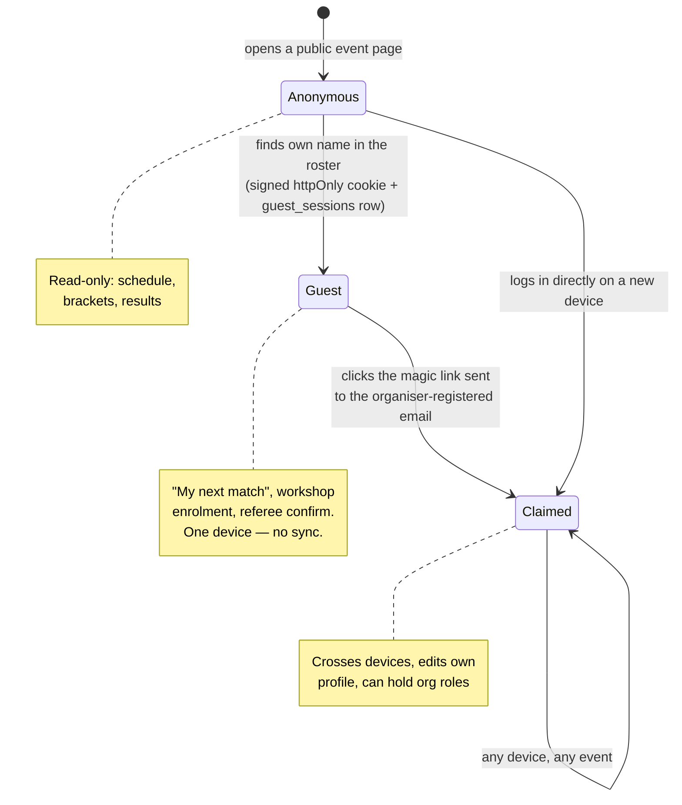

The line between Guest and Claimed is drawn at **anything that crosses devices or grants editing
rights** — see the capability matrix in §12.2.

**Runtime identity resolution.** Those three product-level tiers map onto four identity kinds the global
`AuthGuard` resolves on every request ([`auth.guard.ts`](../apps/api/src/common/auth/auth.guard.ts)). A
fourth kind, `staff`, has no place in the progression above: it is an event-scoped scorekeeper/referee
login issued from a PIN, not a participant identity.

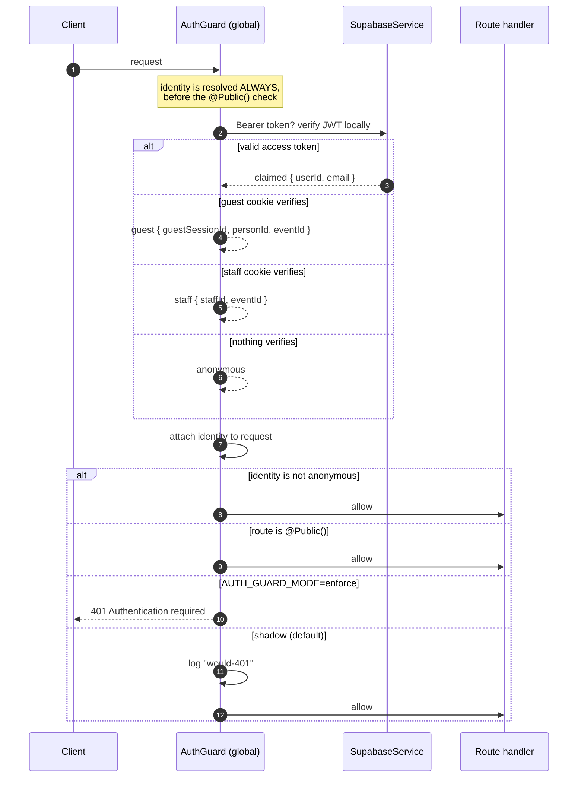

Three details that matter:

- **Precedence is claimed → guest → staff.** The first mechanism that verifies wins; an expired or
  forged cookie falls through to the next rather than failing the request.
- **Identity is resolved before `@Public()`, never after.** `@Public()` gates only the _throw_, which
  keeps `identity` a total function on every request. Short-circuiting earlier would leave it undefined
  on the highest-traffic routes and let a later `identity ?? anonymous` quietly reinstate fail-open.
- **The guard verifies the access token locally**, without a GoTrue round-trip. The round-trip (with
  local-JWT fallback on GoTrue outage) lives in `SupabaseService.getAuthUser`, used where freshness
  matters — see §12.5.

`AUTH_GUARD_MODE` defaults to `shadow`: the guard logs what it _would_ have rejected instead of
rejecting, so the enforcement flip can be made once the would-401 log is clean.

### 12.2 Capability matrix

| Capability                                  | Anonymous | Guest             | Claimed              |
| ------------------------------------------- | --------- | ----------------- | -------------------- |
| Browse public schedule, brackets, results   | ✅        | ✅                | ✅                   |
| See "my next match", "my pool"              | ❌        | ✅                | ✅                   |
| Enroll/cancel workshop sessions             | ❌        | ✅                | ✅                   |
| Confirm/decline referee assignment          | ❌        | ✅                | ✅                   |
| Mark favorite fighters (accompanist)        | ❌        | ✅ (this device)  | ✅ (synced)          |
| Subscribe to push notifications             | ❌        | ✅ (this device)  | ✅ (cross-device)    |
| Use a second device                         | ❌        | ❌ (re-pick name) | ✅ (login link)      |
| Edit own profile (display name, bio, photo) | ❌        | ❌                | ✅                   |
| Change login / roster email                 | ❌        | ❌                | ✅ (new-email link)  |
| Promote Person → global Fighter profile     | ❌        | ❌                | ✅                   |
| See full email address (instead of mask)    | ❌        | ❌                | ✅ (own only)        |
| Access organizer admin                      | ❌        | ❌                | ✅ (if granted role) |

The line between Guest and Claimed is deliberately drawn at **anything that crosses devices or grants editing rights**. Casual users never need to claim. Power users get a one-time magic link.

### 12.3 First-arrival flow (the critical UX)

1. Participant opens `app.myclash.fr/e/<event>` on their phone.
2. Onboarding asks: "What's your name?" (single text input, not separated into first/last — easier on mobile).
3. As they type, the app debounces and queries the lookup endpoint:
   ```
   GET /api/v1/events/:id/persons/lookup?q=jean+dup
   →  [
        { id, given_name, family_name, club_label, masked_email },
        ...
      ]
   ```
4. Match list appears with **club name visible, email masked** (`j***@gmail.com`). The combination of name + club is sufficient to disambiguate in 99% of HEMA cases.
5. Participant taps their entry.
6. Server creates a `guest_sessions` row, sets a signed httpOnly cookie (`mc_guest=<jwt>`), returns the Person details.
7. UI: "Welcome Jean. Your matches are in the schedule. Want to get push notifications and use this profile on your tablet too? [Send me a login link] [Maybe later]"

If "Send me a login link": email goes to the organizer-registered address. Click → claimed account. From then on, no name typing, just email-based login.

### 12.4 Edge cases

**"I'm not in the list"** — the lookup endpoint returns an `[I'm none of these]` option. Tapping it surfaces:

> _Only people pre-registered by the organizer can use this app. If you should be in the list, please find an organizer at the registration desk._

This is intentional — preventing self-registration is what makes guest sessions safe. Without it, anyone could type "Pierre Lambert" and act as Pierre.

**Name collision (two Jean Dupont)** — the lookup shows both with club names. If both are at the same club, masked emails plus a creation-date hint disambiguate. Worst case: force the magic link.

**Spelling variations** — the lookup uses fuzzy matching (Postgres `pg_trgm` similarity). "jean" finds "Jean", "Jéan", "Jean-Pierre". The organizer's CSV import should normalize accents (`unaccent`) on the lookup side, but preserve the original spelling for display.

**Switching devices as a Guest** — the participant types their name again on the new device. They get a fresh guest session on Person X. Push subscriptions are per-session (per-device), so each device subscribes independently. That's fine — Guest is explicitly "this device only."

**Email typos by the organizer** — if the participant's email in the roster is wrong, they can't claim. The organizer admin has an "edit person" form. After a participant has claimed a profile, they can change their login/roster email through `/e/<eventSlug>/profile/email`; the new email must confirm by link before Supabase Auth and all claimed Person rows are updated.

### 12.5 Implementation notes

- The lookup endpoint uses Postgres `pg_trgm` indexes on `unaccent(given_name)` and `unaccent(family_name)`.
- Guest session JWTs are signed with a separate secret from Supabase auth (`MYCLASH_GUEST_JWT_SECRET`) to keep them strictly bounded — they never grant access to anything beyond their Person.
- All admin actions (organizer/super) require **Supabase claimed accounts** with the appropriate `OrganizationMembership` row. Guest sessions cannot administer anything, ever.
- Email masking: show first character + asterisks + domain first character + `***` + TLD. `jean.dupont@gmail.com` → `j***@g***.com`.
- RLS policies key off `auth.uid()` for claimed actions and a JWT claim `mc_guest_person_id` for guest actions.

### 12.6 Roles (unchanged from earlier draft)

```
PlatformRole:
  - super_admin     : you; full platform access
  - none            : default

OrganizationRole:
  - owner           : full org control, billing (future), member mgmt
  - admin           : event creation, all org events
  - editor          : assigned events only
  - scorekeeper     : assigned Lices only (records exchanges)
  - referee         : assigned Lices/matches (calls actions on the piste)
  - workshop_lead   : can edit workshop content for assigned workshops
  - read_only       : view-only access (e.g. press, partners)

ImplicitRole (no row needed, derived from claim status + relations):
  - competitor      : Person has registrations in this event
  - workshop_attendee : Person has workshop_enrollments in this event
  - public          : anonymous or unclaimed without other roles
```

OrganizationRole grants always require a **claimed** account. They are never given to guest sessions.

### 12.7 Authentication mechanisms (v1)

- **Magic link via SMTP** (Supabase Auth) — primary mechanism for claimed accounts. Used for organizer login, super admin, and Person claim. Email is the canonical identity.
- **Email + password** (Supabase Auth) — also enabled for organizer accounts, for users who prefer a password to magic-link emails. Available at signup and login.
- **Guest session** (signed cookie + server row) — for participants who only want to find their schedule.
- **Google OAuth** — **deferred**, not in v1. Magic link covers the same use case without requiring 2–4 weeks of Google verification review.

### 12.7bis Organizer signup (open)

**Anyone can sign up to become a event organizer.** No invitation required, no super-admin approval gate at signup time. Super admin retains the power to suspend or remove organizer accounts post-hoc (see §12.7ter).

**Signup flow** (at `https://admin.myclash.fr/signup`):

1. User chooses a method:
   - **Magic link**: enters email + display name → receives link → click → account created.
   - **Email + password**: enters email + display name + password → account created → email verification link sent (must verify before creating events).
2. On account creation, the system **auto-creates a personal Organization** with:
   - `slug`: derived from display name (`jean-dupont`, with collision handling).
   - `name`: `"<display_name>'s organization"` (the user can rename it any time).
   - `status`: `active` (no manual approval needed).
   - The user becomes the `owner` of this Organization (`organization_members.role = 'owner'`).
3. They land on the org dashboard at `/org/<slug>` ready to create their first event.

**What an organizer can do** without further approval:

- Create one or more **Events** (the multi-day gathering, e.g. "FAL 2026") — _terminology TBD pending owner decision_.
- Within each event, create competitions, workshops, schedule, venue.
- Import the participant roster (manual + CSV).
- Run the event end-to-end (registrations → pools → brackets → scoring → results).
- Invite team members to their organization (admin, editor, scorekeeper, referee — see §12.6 roles).

**What an organizer cannot do**:

- See or edit any other organization's data.
- Modify global Fighter profiles created by other organizations (only the organization that originated a Person can edit its details; once the Person is claimed and promoted to a global Fighter, the Fighter is editable by the claimed user).
- Bypass platform-wide RLS policies.

**Default `OrganizationRole.owner` capabilities** include creating events, theming, importing rosters, generating brackets, scoring (or assigning scorekeepers), publishing results, exporting to HEMA Ratings format. They are the admin of their own events.

### 12.7ter Super admin — organizer management

The super admin (project owner) has a dashboard at `https://admin.myclash.fr/admin/organizations` to manage all organizer accounts:

- **List**: every organization with member count, event count, last activity, status.
- **Inspect**: drill into any org to see members, events, and audit log entries.
- **Actions**:
  - **Suspend** an organization (`status = 'suspended'`) — its events become read-only-public; members cannot create new content, but existing data stays visible.
  - **Reactivate** a suspended organization.
  - **Delete** (hard) — for spam / abuse cases. Cascades to events, but global Fighter profiles and Persons that have been claimed by users are preserved (re-attached to a "deleted org" placeholder for data integrity).
  - **Promote a user to super admin** (granting `platform_roles.role = 'super_admin'`).
  - **Reset organization owner** — if the original owner loses access, super admin can re-assign ownership to another member.

**No automatic approval gate at signup** means super admin's job is reactive moderation, not bottleneck approval. This is acceptable because:

- Email verification deters bots.
- Suspending a bad actor is fast (one click, immediate effect).
- Real HEMA events are a small community; bad actors are rare and easily identified.

### 12.7quater User account types — summary

| Account type              | How created                                       | Capabilities                                                                |
| ------------------------- | ------------------------------------------------- | --------------------------------------------------------------------------- |
| **Anonymous**             | No account                                        | Public reads, localStorage follows                                          |
| **Guest**                 | Picked self from organizer's roster               | Per-event guest capabilities                                                |
| **Claimed (participant)** | Magic link to organizer-registered email          | Cross-device, edit own profile                                              |
| **Organizer**             | Self-signup (magic link or email+password)        | Owns one organization, can create events                                    |
| **Organizer team member** | Invited by an existing organizer                  | Per-org role: admin, editor, scorekeeper, referee, workshop_lead, read_only |
| **Super admin**           | Promoted by another super admin (or DB bootstrap) | Platform-wide moderation                                                    |

The Claimed-Participant and Organizer paths can converge: a Person who claims their profile on event day is a "claimed account"; if they later self-sign-up as an organizer at a different event, the same `auth.users` row is reused.

### 12.8 CSV import for the organizer roster

The organizer admin imports persons via a two-pass wizard:

1. **Preview** (`POST /api/v1/events/:eventId/persons/import/preview`) — dry run, no writes.
2. **Commit** (`POST /api/v1/events/:eventId/persons/import`) — applies, accepts optional `decisions[]` JSON field.

**CSV columns (email optional since T-1208):**

```csv
given_name,family_name,email,club,club_abv,club_city,hema_ratings_id,event_codes,roles
Jean,Dupont,jean@example.com,Lyon AMHE,LAMHE,Lyon,12345,longsword-open,competitor
Marie,Lefèvre,,Cercle PRMD,CPRMD,,,,competitor
Pierre,Martin,,,,,,,referee
```

- `email` is **optional**; when absent, duplicate detection falls back to case-insensitive full-name match.
- `club_abv` — short abbreviation (e.g. `DFDA`). Club lookup: exact abbreviation match > trigram name similarity ≥ 0.85 (`high`) > ≥ 0.40 (`medium`) > auto-create unverified.
- `club_city` — stored on auto-created clubs.
- `event_codes` are semicolon-separated event slugs; auto-creates a registration row per code.
- `roles` semicolon-separated set: `competitor`, `referee`, `workshop_lead`.

**Preview response shape (`ImportPreviewResponse`):**

```json
{
  "summary": { "toCreate": 42, "toLink": 3, "duplicates": 1, "invalid": 1 },
  "newClubs": ["Hammaborg"],
  "rows": [
    {
      "index": 0,
      "givenName": "Jean",
      "familyName": "Dupont",
      "email": "jean@example.com",
      "status": "ok",
      "clubResolution": {
        "confidence": "exact_abv",
        "resolvedName": "Lyon AMHE",
        "abbreviation": "LAMHE"
      },
      "globalPersonMatch": {
        "id": "...",
        "displayName": "Jean Dupont",
        "clubName": "Lyon AMHE",
        "abbreviation": "LAMHE",
        "email": "j***@gmail.com"
      },
      "defaultAction": "link"
    }
  ]
}
```

When a row has `globalPersonMatch`, the organizer can override `defaultAction` (`link` | `create_new`) before committing. The `decisions[]` array is sent as a JSON form field alongside the re-uploaded file.

**Commit response shape (`CsvImportReport`):**

```json
{
  "created": 44,
  "updated": 0,
  "duplicates": [{ "row": 12, "name": "Jean Dupont", "existingEmail": "j***@gmail.com" }],
  "invalid": [{ "row": 18, "reason": "Missing given_name", "raw": ",Martin,,,,," }],
  "newClubsForReview": ["Hammaborg"]
}
```

Manual creation uses the same form, single-row, in `/org/[orgSlug]/events/[eventId]/persons/new`.

---

## 13. Per-Event Theming

### 13.1 Scope

Each event can customize:

- Logo, hero image, favicon.
- Color palette (primary, secondary, accent, background).
- Display font (the prototype uses Cinzel; allow per-event override).
- Event-specific landing copy (Markdown).
- Custom pages (history, location, partners, media kit) — Markdown with frontmatter.
- Club directory (curated list of nearby clubs with descriptions, like the prototype).
- "Discipline" pages (history of longsword, sidesword, etc.) — Markdown.

### 13.2 URL shape

- Event public site: `/e/{event-slug}`
- Tournament page: `/e/{event-slug}/t/{tournament-slug}`
- Match page: `/e/{event-slug}/match/{match-id}`
- Lice live view: `/e/{event-slug}/lice/{lice-name}`
- Fighter profile (in event context): `/e/{event-slug}/fighters/{fighter-slug}`

(See §15.1 for the authoritative route tree.)

Global (cross-event):

- Fighter profile: `/fighters/{slug}`
- Club: `/clubs/{slug}`
- Events index: `/events`

### 13.3 Implementation

- Theme stored in DB (`themes` table).
- CSS variables injected at the layout level for the `/e/[eventSlug]/...` route group.
- Custom CSS field (sandboxed, vetted) for advanced tweaks.

---

## 14. API Surface

### 14.1 Style

- REST for CRUD, JSON request/response.
- WebSocket gateway (NestJS `@WebSocketGateway`) for scoring events that need bi-directional flow.
- All endpoints versioned under `/api/v1/...`.
- All endpoints documented via OpenAPI (Swagger UI at `/api/docs` in dev).

### 14.2 Endpoint inventory (non-exhaustive)

```
# Auth (handled by Supabase, mirrored views)
GET    /api/v1/me                              # returns claimed user OR active guest

# Persons (organizer roster — pre-event)
GET    /api/v1/events/:id/persons         [organizer+]
POST   /api/v1/events/:id/persons         [organizer+]   # manual create
POST   /api/v1/events/:id/persons/import/preview  [organizer+]   # CSV dry-run (no writes)
POST   /api/v1/events/:id/persons/import         [organizer+]   # CSV commit (accepts decisions[])
GET    /api/v1/persons/:id                     [organizer+ or self]
PATCH  /api/v1/persons/:id                     [organizer+]
DELETE /api/v1/persons/:id                     [organizer+]   # only if no registrations

# Person lookup (the participant's "type your name" search)
GET    /api/v1/events/:id/persons/lookup?q=...  [public]
                                               # returns minimal fields:
                                               # id, given_name, family_name,
                                               # club_label, masked_email
                                               # rate-limited per IP

# Public people search (richer than lookup; for the "find a fighter" feature)
GET    /api/v1/events/:id/people?q=...&role=...&club=...  [public]
                                               # returns: id, names, club_label,
                                               # photo_url, role_badges,
                                               # next_event_at, follow_state
                                               # for the requesting session

# Public profile, schedule, results — for ANY person (subject to their privacy prefs)
GET    /api/v1/events/:id/people/:personId               [public]
GET    /api/v1/events/:id/people/:personId/schedule      [public]
                                               # returns matches + referee_slots
                                               # workshops included by default;
                                               # excluded only if person_privacy
                                               # .hide_workshops_publicly is true
                                               # AND requester is not that person
GET    /api/v1/events/:id/people/:personId/results       [public]

# Following (anonymous gets localStorage; guest|claimed gets server-stored)
GET    /api/v1/events/:eventId/follows                       [guest|claimed]
POST   /api/v1/events/:eventId/follows                       [guest|claimed]
                                               # body: { personId }
DELETE /api/v1/events/:eventId/follows/:personId             [guest|claimed]
PATCH  /api/v1/events/:eventId/follows/:personId             [guest|claimed]
                                               # body: { notifyMatchStart, notifyWorkshopStart }

# Cross-event follows (People Hub — follow a global person everywhere)
GET    /api/v1/me/follows                                    [guest|claimed]
POST   /api/v1/me/follows/by-global-person                   [guest|claimed]
                                               # body: { globalPersonId }
                                               # follows the person across all their events
DELETE /api/v1/me/follows/by-global-person/:globalPersonId   [guest|claimed]

# Privacy preferences (Person can only edit their own; requires claimed)
GET    /api/v1/persons/me/privacy                             [claimed, owns person]
PATCH  /api/v1/persons/me/privacy                             [claimed, owns person]

# Claimed-user email change
GET    /api/v1/persons/me/email-change                         [claimed]
POST   /api/v1/persons/me/email-change                         [claimed] # body: { newEmail }
DELETE /api/v1/persons/me/email-change                         [claimed]
GET    /api/v1/persons/me/email-change/confirm?token=...        [public token]

# Guest sessions (participant's pick-myself flow)
POST   /api/v1/events/:id/guest-sessions  [public]
                                               # body: { person_id }
                                               # creates session, sets cookie,
                                               # returns Person details
DELETE /api/v1/guest-sessions/me               [guest|claimed]
                                               # explicit logout for this device

# Claim flow (Person → Supabase user)
POST   /api/v1/events/:id/persons/:id/request-claim  [public|guest]
                                               # sends magic link to person.email
                                               # rate-limited per person, per IP

# Fighters (global, cross-event)
GET    /api/v1/fighters?q=...&club=...
GET    /api/v1/fighters/:slug
POST   /api/v1/fighters                    [organizer+]
PATCH  /api/v1/fighters/:id                [organizer+ or claimed]
POST   /api/v1/fighters/:id/promote        [claimed]
                                               # promotes a Person → global Fighter
POST   /api/v1/fighters/merge              [super_admin]

# Global persons
GET    /api/v1/global-persons?q=...&roles=fighter
POST   /api/v1/global-persons              [organizer+]
PATCH  /api/v1/global-persons/:id/roles    [organizer+]
POST   /api/v1/global-persons/import       [super_admin]   # bulk CSV import (dedup by name)

# Clubs
GET    /api/v1/clubs?q=...&country=...&searchAbv=true
GET    /api/v1/clubs/:slug
POST   /api/v1/clubs                       [organizer+]
PATCH  /api/v1/clubs/:id                   [super_admin]   # edit name, abbreviation, city, country

# Organizations
GET    /api/v1/organizations               [super_admin]
POST   /api/v1/organizations               [authenticated, requires approval]
GET    /api/v1/organizations/:id
PATCH  /api/v1/organizations/:id           [owner|super_admin]
POST   /api/v1/organizations/:id/approve   [super_admin]
POST   /api/v1/organizations/:id/members   [owner]

# Events (the gathering — was "Tournaments" pre-v1.4)
GET    /api/v1/events                      [public, filtered]
POST   /api/v1/events                      [organizer+]
GET    /api/v1/events/:slug
PATCH  /api/v1/events/:id                  [organizer+]
POST   /api/v1/events/:id/publish          [organizer+]
GET    /api/v1/events/:id/theme
PATCH  /api/v1/events/:id/theme            [organizer+]
GET    /api/v1/events/:id/lices
POST   /api/v1/events/:id/lices            [organizer+]
GET    /api/v1/events/:id/stats            [public]

# Tournaments (a competition within an event — was "Events" pre-v1.4)
POST   /api/v1/events/:id/tournaments      [organizer+]
GET    /api/v1/tournaments/:id
GET    /api/v1/tournaments/:id/registrations
POST   /api/v1/tournaments/:id/registrations    [organizer+]
GET    /api/v1/tournaments/:id/phases
POST   /api/v1/tournaments/:id/phases           [organizer+]
GET    /api/v1/tournaments/:id/standings        [public]
GET    /api/v1/tournaments/:id/final-ranking    [public]
GET    /api/v1/tournaments/:id/stats            [public]
GET    /api/v1/tournaments/:id/pools            [visibility-filtered]
GET    /api/v1/tournaments/:id/bracket          [visibility-filtered]
POST   /api/v1/tournaments/:id/generate-pools   [organizer+]
POST   /api/v1/tournaments/:id/generate-bracket [organizer+]
PATCH  /api/v1/phases/:id/visibility            [organizer admin+]
PATCH  /api/v1/bracket-slots/:id               [organizer+]  # manual slot override

# Matches
GET    /api/v1/matches/:id
POST   /api/v1/matches/:id/start           [scorekeeper+]
POST   /api/v1/matches/:id/halt            [scorekeeper+]
POST   /api/v1/matches/:id/resume          [scorekeeper+]
POST   /api/v1/matches/:id/end             [scorekeeper+]
POST   /api/v1/matches/:id/void            [organizer+]

# Exchanges
GET    /api/v1/matches/:id/exchanges
POST   /api/v1/matches/:id/exchanges       [scorekeeper+]
                                           # idempotent on client_uuid
PATCH  /api/v1/exchanges/:id/void          [organizer+]

# Stats
GET    /api/v1/events/:id/stats/overview
GET    /api/v1/tournaments/:id/stats/exchanges-distribution
GET    /api/v1/tournaments/:id/stats/target-zones
GET    /api/v1/tournaments/:id/stats/double-rate-evolution
GET    /api/v1/tournaments/:id/stats/deep-target-leaderboard
GET    /api/v1/tournaments/:id/stats/per-fighter

# Workshops (scoped to event)
GET    /api/v1/events/:id/workshops                    [public]
POST   /api/v1/events/:id/workshops                    [organizer+]
GET    /api/v1/workshops/:id
PATCH  /api/v1/workshops/:id                           [organizer+]
POST   /api/v1/workshops/:id/instructors               [organizer+]
POST   /api/v1/workshops/:id/sessions                  [organizer+]
PATCH  /api/v1/workshop-sessions/:id                   [organizer+]
GET    /api/v1/workshop-sessions/:id/roster            [organizer+]
POST   /api/v1/workshop-sessions/:id/enroll            [authenticated]
DELETE /api/v1/workshop-sessions/:id/enroll            [authenticated]
POST   /api/v1/workshop-sessions/:id/promote/:userId   [organizer+]

# Refereeing (event-scoped — qualifications and assignments per event)
GET    /api/v1/events/:id/referee-assignments          [organizer+]
POST   /api/v1/events/:id/referee-assignments          [organizer+]
PATCH  /api/v1/referee-assignments/:id                 [organizer+ or assigned user]
POST   /api/v1/referee-assignments/:id/confirm         [assigned user]

# Referee qualifications (per event)
GET    /api/v1/tournaments/:id/referee-qualifications  [organizer+]
POST   /api/v1/tournaments/:id/referee-qualifications  [organizer+]
PATCH  /api/v1/referee-qualifications/:id              [organizer+]
DELETE /api/v1/referee-qualifications/:id              [organizer+]

# Auto-assignment & feasibility
POST   /api/v1/events/:id/populate-pools               [organizer+]
                                                       # body: { settings, dryRun }
                                                       # returns proposed assignments + cost report
POST   /api/v1/events/:id/auto-assign-referees         [organizer+]
                                                       # body: { settings, dryRun }
                                                       # returns assignments + missing-role report
POST   /api/v1/events/:id/lock-referee-assignments     [organizer+]
                                                       # transitions assignments to 'assigned'
                                                       # triggers notifications
GET    /api/v1/tournaments/:id/pool-assignment-settings [organizer+]
PATCH  /api/v1/tournaments/:id/pool-assignment-settings [organizer+]

# My Schedule (unified personal view)
GET    /api/v1/tournaments/:id/my-schedule             [authenticated]
                                                       # returns matches + referee + workshops
                                                       # with conflicts annotated

# Notifications
GET    /api/v1/notifications/preferences               [authenticated]
PATCH  /api/v1/notifications/preferences               [authenticated]
POST   /api/v1/notifications/subscribe                 [authenticated]
                                                       # registers push subscription
DELETE /api/v1/notifications/subscribe/:id             [authenticated]
GET    /api/v1/notifications/vapid-public-key          [public]
GET    /api/v1/notifications/broadcasts                [authenticated]
POST   /api/v1/events/:eventId/notifications/broadcast [organizer admin+]
       # targetType all|fighters|referees|fighters_and_referees|specific_persons; optional tournamentId
GET    /api/v1/events/:eventId/notifications/broadcasts [organizer admin+]

# Exports
GET    /api/v1/events/:id/export?format=csv|json|hema-ratings|pdf

# HEMA Ratings
GET    /api/v1/hema-ratings/search?q=...
GET    /api/v1/hema-ratings/:hr-id

# Directory groups (People Hub — user-curated groups of global persons)
GET    /api/v1/me/groups                                [claimed]
POST   /api/v1/me/groups                                [claimed]
PATCH  /api/v1/me/groups/:groupId                       [claimed]
DELETE /api/v1/me/groups/:groupId                       [claimed]
POST   /api/v1/me/groups/:groupId/members               [claimed]   # add a global person
DELETE /api/v1/me/groups/:groupId/members/:globalPersonId  [claimed]

# Leagues / Classement (cross-event standings)
GET    /api/v1/leagues                                  [public, filtered]
GET    /api/v1/leagues/attachable                       [organizer+]
GET    /api/v1/leagues/:slug                            [public]
GET    /api/v1/leagues/:leagueId/standings              [public]
GET    /api/v1/leagues/:leagueId/final-report.csv       [public]
GET    /api/v1/leagues/:leagueId/final-report.print.html [public]
GET    /api/v1/organizations/:orgId/leagues             [org member+]
GET    /api/v1/admin/leagues                            [super_admin]
POST   /api/v1/admin/leagues                            [super_admin]
PATCH  /api/v1/admin/leagues/:leagueId                  [league manager+]
DELETE /api/v1/admin/leagues/:leagueId                  [super_admin]
POST   /api/v1/admin/leagues/:leagueId/tournaments/:tournamentId/link  [league manager+]
GET    /api/v1/admin/leagues/:leagueId/requests         [league manager+]
POST   /api/v1/admin/leagues/:leagueId/organization-roles [league manager+]
POST   /api/v1/admin/leagues/:leagueId/user-roles       [league manager+]
POST   /api/v1/admin/leagues/:leagueId/recompute        [league manager+]
       # + league-group, logo, membership-request, and link-management routes
       # (see leagues.controller.ts / league-membership-requests.controller.ts)

# AI (model registry, provider settings, usage & budget)
GET    /api/v1/ai/models                                [organizer+]   # provider model registry
GET    /api/v1/organizations/:orgId/ai-settings         [org member+]
PUT    /api/v1/organizations/:orgId/ai-settings         [owner|super_admin]
DELETE /api/v1/organizations/:orgId/ai-settings         [owner|super_admin]
GET    /api/v1/organizations/:orgId/ai-usage/summary    [org member+]  # consumption dashboard
PATCH  /api/v1/organizations/:orgId/ai-settings/budget  [owner|super_admin]
PATCH  /api/v1/organizations/:orgId/ai-settings/flags   [owner|super_admin]
GET    /api/v1/events/:eventId/ai-usage                 [organizer+]

# WebSocket
WS     /ws  (channels: subscribe to event:{id}, lice:{id}, match:{id})
```

### 14.3 Rate limits

Enforced by `ThrottlerModule` in `apps/api/src/app.module.ts`; the shared profiles
live in `apps/api/src/common/throttling/throttle-profiles.ts`. Limits are per
client IP unless stated otherwise, and IPs listed in `THROTTLE_IP_WHITELIST` skip
all of them.

| Scope                                                                  | Limit                                                |
| ---------------------------------------------------------------------- | ---------------------------------------------------- |
| Default — every route, reads and writes alike                          | 120 req/min/IP                                       |
| Login, magic link, password-reset-confirm                              | 10 req/hour/IP                                       |
| Login **per email** — `password-login` + `public-login` share a bucket | 10 req/hour                                          |
| Signup, password-reset request                                         | 5 req/hour/IP                                        |
| Admin reads — `/admin/users`, fighter merge audit-log                  | 600 req/min/IP                                       |
| Catalog reads — `/clubs`, `/global-persons`                            | 300 req/min/IP                                       |
| Event persons lookup                                                   | 30 req/min/IP                                        |
| AI natural-language query                                              | 60/hour per (tournament, user); admin-settable 1–500 |

`req.ip` is resolved through `trustProxy: 1` on the Fastify adapter, so it is the
address Traefik observed rather than a client-supplied `X-Forwarded-For` entry.

Two limits worth knowing about: the throttler store is in-memory, so counters are
per API container and reset on every redeploy; and there is no edge-level
(Traefik) rate limiting, so the Nest guard is the only limiter in front of the API.
There are no per-user or per-org limiters, and scoring writes get the default.

---

## 15. Frontend Routes

### 15.1 `web-public` (Next.js)

```
/                                       # Platform landing
/events                                 # Index of all published events
/fighters                               # Search global fighters
/fighters/[slug]                        # Fighter profile
/clubs/[slug]                           # Club page
/about, /docs, /privacy

# Per-event (themed)  — was `/t/[slug]/...` pre-v1.4
/e/[eventSlug]                                          # Event landing (themed)
/e/[eventSlug]/onboarding                               # Persona selection (multi-select)
/e/[eventSlug]/home                                     # Event home (the front door)
/e/[eventSlug]/my-schedule                              # UNIFIED personal view (matches + referee + workshops + conflicts)
/e/[eventSlug]/tournaments                              # Event index (e.g. "Longsword Open", "Sidesword Open")
/e/[eventSlug]/t/[tournamentSlug]                       # Tournament detail (pools + brackets)
/e/[eventSlug]/t/[tournamentSlug]/pools/[poolId]
/e/[eventSlug]/t/[tournamentSlug]/bracket
/e/[eventSlug]/t/[tournamentSlug]/standings
/e/[eventSlug]/t/[tournamentSlug]/stats
/e/[eventSlug]/lice/[liceName]                          # Live view of a Lice
/e/[eventSlug]/match/[matchId]                          # Match detail page
/e/[eventSlug]/fighters/[fighterSlug]                   # Fighter in event context
/e/[eventSlug]/clubs                                    # Club directory (per-event curated)
/e/[eventSlug]/info                                     # Practical info, schedule, location
/e/[eventSlug]/discipline/[code]                        # e.g. /discipline/longsword (history page)
/e/[eventSlug]/workshops                                # Workshop catalog (filterable)
/e/[eventSlug]/w/[workshopSlug]                         # Workshop detail with sessions
/e/[eventSlug]/people                                   # Search any fighter / referee in this event
/e/[eventSlug]/people/[personId]                        # Public profile: schedule, results, follow button
/e/[eventSlug]/following                                # Watchlist: everyone I'm tracking
/e/[eventSlug]/referee                                  # Referee dashboard (when role applies)
/e/[eventSlug]/referee/match/[matchId]                  # On-piste referee tools
/e/[eventSlug]/profile                                  # User profile in event context
/e/[eventSlug]/profile/privacy                          # Privacy preferences (claimed only)
/e/[eventSlug]/profile/email                            # Login / roster email change (claimed only)
/e/[eventSlug]/notifications                            # Notification preferences + history

# Personal space (/me/*) — claimed-user hub, cross-event
/me                                                    # Personal dashboard / people hub
/me/profile                                            # Global profile
/me/security                                           # Password / auth
/me/settings                                           # Preferences (locale, etc.)
/me/notifications                                      # Notification preferences + history
/me/fighter                                            # Fighter self-service (incl. AI settings)
/me/referee                                            # Referee profile
/me/follows                                            # Followed people across events
/me/leagues                                            # Leagues I compete in
/me/leagues/[slug]                                     # League detail / standings
/me/events                                             # My events
/me/events/[eventSlug]                                 # Personal event overlay
/me/events/[eventSlug]/{overview,schedule,workshops}
/me/events/[eventSlug]/t/[tournamentSlug]              # Personal tournament view
/me/claim-confirm                                      # Magic-link claim confirmation
```

### 15.2 `web-staff`

```
/login
/lice                                   # Pick assigned Lice
/lice/[liceId]                          # Active scoring screen
/lice/[liceId]/queue                    # Upcoming matches on this Lice
/lice/[liceId]/match/[matchId]          # Match scoring screen
/lice/[liceId]/sync                     # Sync status / pending exchanges
/settings
```

### 15.3 `web-admin`

```
/login
/signup                                  # Open organizer signup (T-009b)

# Organizer
/org/[orgSlug]                           # Org dashboard
/org/[orgSlug]/settings                  # Org name, members, billing later
/org/[orgSlug]/members                   # Invite/remove team members
/org/[orgSlug]/leagues                   # Org-owner leagues (Manage | Discover)
/org/[orgSlug]/leagues/[leagueId]        # League management for this org
/org/[orgSlug]/events
/org/[orgSlug]/events/new
/org/[orgSlug]/events/[eventId]/...
   /general                              # Name, dates, location, status
   /theme                                # Per-event theming
   /lices                                # Pistes
   /persons                              # Roster (CSV import + manual create)
   /persons/[personId]                   # Edit a person
   /tournaments                          # Competitions inside this event
   /tournaments/new
   /tournaments/[tournamentId]/...
      /general                           # Weapon, category, ruleset, ruleset config
      /registrations                     # Pick people from event roster
      /pools
      /bracket
      /matches
      /stats
   /workshops
   /workshops/new
   /workshops/[workshopId]/...
      /general
      /instructors
      /sessions
      /roster
   /referees                             # Referee pool: qualifications + ratings (per event)
   /referees/assignments                 # Referee assignment editor with auto-assign
   /tournaments/[tournamentId]/pool-populator   # Pool populator UI (constraint sliders + manual override)
   /scorekeepers
   /schedule                             # Unified day grid (matches across all tournaments + workshops)
   /leagues                              # Attach this event's tournaments to leagues
   /publish

# Super Admin
/admin
/admin/organizations                     # T-009c: list, suspend, delete, etc.
/admin/organizations/[id]
/admin/users
/admin/fighters                          # Merge, moderation
/admin/rulesets
/admin/leagues                           # Leagues list
/admin/leagues/new
/admin/leagues/[id]/{edit,ranking,requests}
/admin/leagues/scoring-systems           # League scoring-system registry (+ /new, /[id]/edit)
/admin/feature-flags
/admin/audit-log
```

---

## 16. Internationalization

**Status (as of v0.14):** English and French both shipped.

### Library

Custom `@myclash/i18n` package (`packages/i18n/`) — not `next-intl` or `i18next`. Rationale: shared across all apps (Next.js + NestJS) without a React dependency in the core translation layer.

- `packages/i18n/src/messages/{en,fr}/<namespace>.ts` — **the data**, one module per namespace per locale (fr is a **full French translation**, not an `fr = en` alias). Each `fr` module is `satisfies DeepString<typeof en<Ns>>`, so a missing or extra key is a tsc error.
- `packages/i18n/src/runtime.ts` — **the implementation, with none of the data**: `createTranslator`, `negotiateLocale`, `defaultLocale`, `LOCALE_COOKIE`, `SUPPORTED_LOCALES`. Anything that ships to a browser imports `@myclash/i18n/runtime`, because importing them from the package root drags every namespace along behind them.
- `packages/i18n/src/surfaces/{staff,public,admin}.ts` — **per-surface bundles**, exported as `@myclash/i18n/staff` / `/public` / `/admin`. Each app's client provider imports its own; that is what stops all 6,418 keys reaching every bundle. Of 6,418: staff resolves 480, public 1,765, admin 5,257.
- `packages/i18n/src/index.ts` — composes the lot and re-exports the runtime, so the package's public API is unchanged. Importing **this** pulls every namespace: correct on the server and in tests, wrong in a client module.
- `apps/{web-public,web-admin,web-staff}/src/i18n/I18nProvider.tsx` — the React context provider is **per-app** (one copy in each Next.js app), not in the package.

### ESLint enforcement

Custom `no-literal-string` rule in `eslint-rules/no-literal-string.mjs` — fails the build on any hardcoded user-facing string not routed through `t()`. A `// i18n-ignore` escape hatch exists for technical strings (error codes, test IDs).

### Locale routing

Each Next.js app wraps its root layout with its own `src/i18n/I18nProvider`, a six-line client module binding the shared provider from `@myclash/next-i18n/client` to that app's surface, and renders `<html lang={locale}>` from `resolveServerLocale()`. `defaultLocale` is `'en'` — EN is the source/default locale; the client `useI18n()` hook is locale-aware. Multi-locale URL routing is deferred to v2.

### Adding a string

1. Add the key to `packages/i18n/src/messages/en/<namespace>.ts`
2. Add the French translation at the matching path in `messages/fr/<namespace>.ts`; every key must exist in both — the FR module is typed against the EN one, and `packages/i18n/src/t-key-references.test.ts` fails on misses either way
3. Use `t('key')` in the component via the `useI18n()` hook — never the module-level `t`, which is bound to `defaultLocale` and is banned in client components by `myclash/no-module-translator-in-client`
4. If the key belongs to a namespace a surface does not yet carry, add it to that surface in `packages/i18n/src/surfaces/`

---

## 17. Deployment (Docker Compose + Traefik)

### Topology at a glance

Three views of the production stack. They are generated from
[`infra/docker-compose.prod.yml`](../infra/docker-compose.prod.yml), which stays authoritative — the
tables in §17.1 below carry the image tags and roles, so these diagrams deliberately do not repeat them.

#### Edge and request routing

Six public hostnames fan out into 17 routers. What a flat table cannot show is **priority**: on
`app.${DOMAIN}` a request is tested against `/api/v1` (30) before `/realtime/v1/api` (25) before the
`/realtime/v1`, `/auth/v1`, `/rest/v1` and `/storage/v1` prefixes (20), and only falls through to
web-public (1) if nothing else matched.

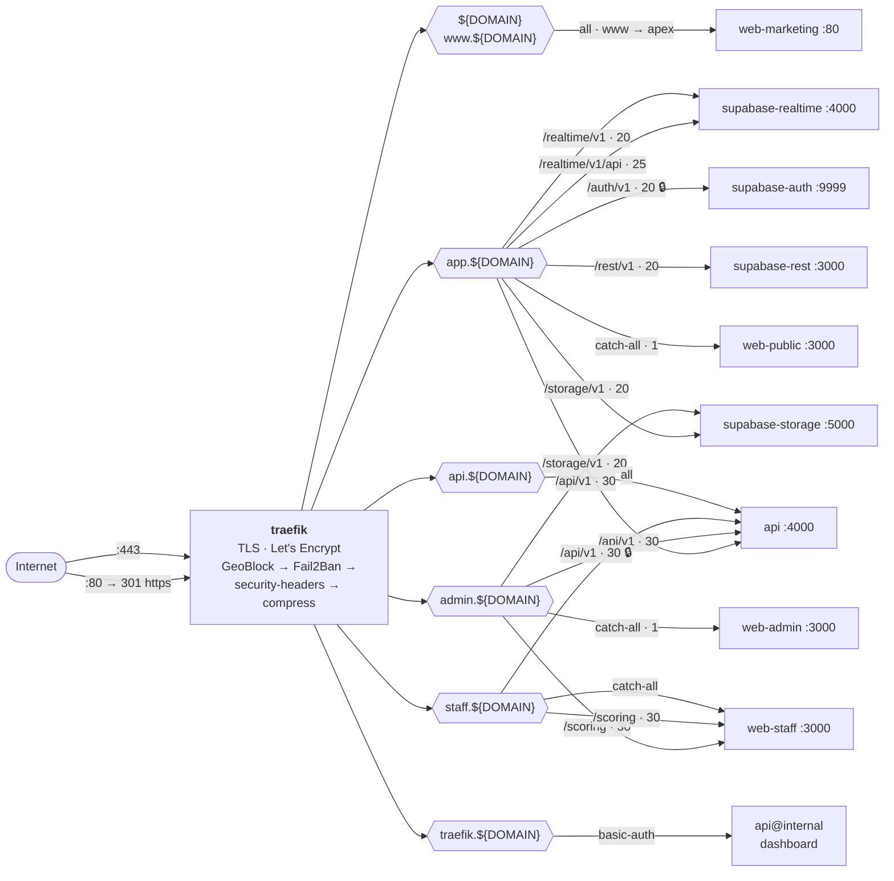

🔒 marks the two paths guarded by Fail2Ban. They are guarded precisely because the application-level
throttler cannot reach them: `/auth/v1` proxies straight to GoTrue without passing through NestJS, and
staff PIN login carries no `@Throttle` override (see §14.3). Port 80 exists only to redirect to 443, and
**Traefik is the only container that publishes ports**.

#### Internal service dependencies

Everything below sits on the single `myclash` bridge network and is unreachable from outside except
through Traefik.

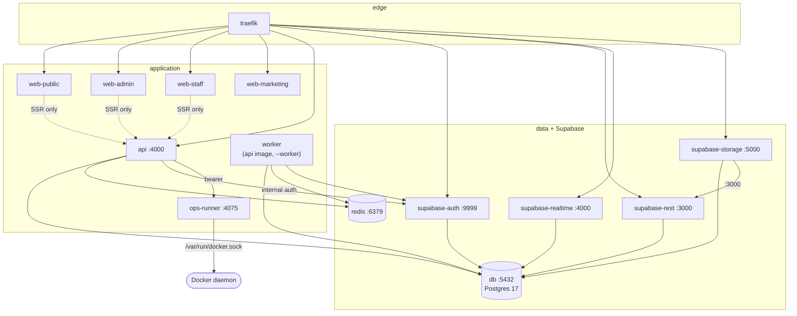

The dotted edges are **server-side rendering only** — via `API_URL_INTERNAL=http://api:4000`. Browser
traffic from those same apps goes back out and in through Traefik instead. That distinction matters
operationally: SSR calls arrive without an `X-Forwarded-For`, so they all share one rate-limit bucket
keyed on the calling container's address (§14.3).

`ops-runner` mounts the Docker socket and deliberately carries **no Traefik router** — it is reachable
only from inside the network, which is why the socket lives there rather than in the API container
(§17.4). `check-infra-review.mjs` fails the build if a router label ever appears on it.

#### External dependencies and persistence

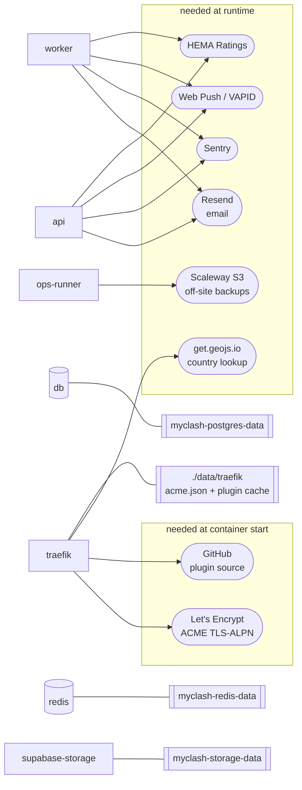

The split matters for deploys. A failure in the **boot** group stops a deploy: Traefik fetches both plugin
modules from GitHub at startup (cached afterwards in `./data/traefik/plugins`) and needs Let's Encrypt for
certificates. A failure in the **runtime** group degrades a feature but leaves the site serving — with one
exception worth knowing: GeoBlock calls `get.geojs.io` for every uncached client IP, which is why the
public instance is configured to fail _open_ (see INFRASTRUCTURE_REVIEW.md § "Edge plugins").

#### How local dev differs

The dev stack (`infra/docker-compose.dev.yml`) mirrors the topology above — same services, same Traefik
routing, same plugins. The deltas:

- Self-signed certificates for `*.myclash.localhost` instead of Let's Encrypt.
- web-marketing is served at `marketing.myclash.localhost`, since the apex is taken by web-public.
- `db` and `redis` publish their ports for local tooling; the dashboard is exposed on `:8080`.
- Plugin middlewares are attached literally, with no `TRAEFIK_PLUGINS` kill-switch — dev is where a
  broken plugin config should surface.

### 17.1 Service inventory

The production stack is defined in [`infra/docker-compose.prod.yml`](../infra/docker-compose.prod.yml). That file is authoritative — this table is a navigation aid. Container names follow the `myclash-<service>` convention via the `COMPOSE_PROJECT_NAME` env var. All services share a single internal `myclash` network; only Traefik publishes ports 80/443.

| Service             | Container                   | Image / Build                              | Role                                                                                                  |
| ------------------- | --------------------------- | ------------------------------------------ | ----------------------------------------------------------------------------------------------------- |
| `traefik`           | `myclash-traefik`           | `traefik:v3.7.10`                          | TLS termination (Let's Encrypt), label-based routing, dashboard at `traefik.${DOMAIN}`.               |
| `db`                | `myclash-db`                | `supabase/postgres:17.6.1.160`             | Primary Postgres + Supabase init scripts (auth, realtime, postgrest roles). ICU `fr-FR`.              |
| `redis`             | `myclash-redis`             | `redis:8-alpine3.23`                       | Cache + BullMQ queue + pub/sub. 512 MB max, appendonly.                                               |
| `supabase-auth`     | `myclash-supabase-auth`     | `supabase/gotrue:v2.195.0`                 | Email magic link + Google OAuth. JWT TTL 3600 s. Served at `/auth/v1`.                                |
| `supabase-realtime` | `myclash-supabase-realtime` | `supabase/realtime:v2.124.1`               | Phoenix Channels broadcasting Postgres row changes. Served at `/realtime/v1`.                         |
| `supabase-storage`  | `myclash-supabase-storage`  | `supabase/storage-api:v1.68.9`             | S3-compatible storage (photos, club logos). 50 MB upload cap. Served at `/storage/v1`.                |
| `supabase-rest`     | `myclash-supabase-rest`     | `postgrest/postgrest:v14.16`               | PostgREST over the public schema. Served at `/rest/v1`.                                               |
| `supabase-meta`     | `myclash-supabase-meta`     | `supabase/postgres-meta:v0.96.8`           | Schema/DDL API for Studio. **Unrouted** — docker-network only, reachable solely by `supabase-studio`. |
| `supabase-studio`   | `myclash-supabase-studio`   | `supabase/studio`                          | Operator DB console at `studio.${DOMAIN}`. Bypasses RLS — see §17.5.                                  |
| `api`               | `myclash-api`               | Built from `apps/api/Dockerfile`           | NestJS REST + WebSocket gateway on internal port 4000. Depends on `db`, `redis`.                      |
| `worker`            | `myclash-worker`            | Same as `api`, started with `--worker`     | BullMQ consumer — stats aggregation, exports, Ratings sync, push notifications.                       |
| `web-admin`         | `myclash-web-admin`         | Built from `apps/web-admin/Dockerfile`     | Next.js 16 on internal port 3000. Routed at `admin.${DOMAIN}`.                                        |
| `web-public`        | `myclash-web-public`        | Built from `apps/web-public/Dockerfile`    | Next.js 16 on internal port 3000. Routed at `app.${DOMAIN}`.                                          |
| `web-staff`         | `myclash-web-staff`         | Built from `apps/web-staff/Dockerfile`     | Next.js 16 on internal port 3000. Routed at `staff.${DOMAIN}`.                                        |
| `web-marketing`     | `myclash-web-marketing`     | Built from `apps/web-marketing/Dockerfile` | Static HTML on Caddy, port 80. Routed at `${DOMAIN}` and `www.${DOMAIN}` (apex redirect).             |
| `ops-runner`        | `myclash-ops-runner`        | Built from `infra/ops-runner/Dockerfile`   | Bearer-authed sidecar with `/var/run/docker.sock`. Backups, restore, container lifecycle. See §17.4.  |

Traefik routes by Host header. Key mappings:

| Hostname            | Service                 | Path / Notes                                                                                                                                                            |
| ------------------- | ----------------------- | ----------------------------------------------------------------------------------------------------------------------------------------------------------------------- |
| `${DOMAIN}`         | `web-marketing`         | Apex landing page. `www.${DOMAIN}` permanent-redirects to apex.                                                                                                         |
| `app.${DOMAIN}`     | `web-public` + Supabase | Root → web-public. `/auth/v1` → supabase-auth · `/realtime/v1` → supabase-realtime · `/storage/v1` → supabase-storage · `/rest/v1` → supabase-rest (all StripPrefix'd). |
| `admin.${DOMAIN}`   | `web-admin` + `api`     | `/api/v1/*` → api (priority 30), everything else → web-admin.                                                                                                           |
| `staff.${DOMAIN}`   | `web-staff`             | Scorekeeper tablet PWA.                                                                                                                                                 |
| `api.${DOMAIN}`     | `api`                   | NestJS REST endpoint (used by web-staff + dev tools).                                                                                                                   |
| `traefik.${DOMAIN}` | `traefik`               | Dashboard, basic-auth gated via `TRAEFIK_DASHBOARD_AUTH`.                                                                                                               |
| `studio.${DOMAIN}`  | `supabase-studio`       | Operator DB console. IP allowlist **and** basic auth, both mandatory. See §17.5.                                                                                        |

### 17.2 Environments

- `.env.example` committed; `.env` gitignored.
- Local dev: `docker compose --env-file .env -f infra/docker-compose.dev.yml up -d --build` (Traefik with self-signed certs at `*.myclash.localhost`; Supabase is routed through Traefik exactly as in production — the Kong gateway was removed). Or run a partial stack (data services only) and `pnpm dev` for the apps — see the project [README](../README.md#quick-start-developers).
- Production: `docker compose --env-file .env -f infra/docker-compose.prod.yml`, wrapped by `infra/scripts/deploy.sh`, `start.sh`, `stop.sh`, `rollback.sh`.

### 17.3 Backups

Backups now run as **ops-runner operations** rather than direct cron-on-host (see §17.4 for the sidecar's HTTP surface). The schedule, the dump scripts, and the off-site mirror all live behind the ops-runner.

- **Postgres:** nightly `pg_dump` of the `db` container, gzip + optional GPG encryption (`BACKUP_GPG_RECIPIENT`).
- **Storage:** nightly tarball of the `supabase-storage` data volume (`storage_data`).
- **Off-site mirror:** Scaleway Object Storage (S3-compatible). Configured via `BACKUP_SCW_ACCESS_KEY`, `BACKUP_SCW_SECRET_KEY`, `BACKUP_SCW_BUCKET`, `BACKUP_SCW_ENDPOINT`, `BACKUP_SCW_REGION`. When unset, backups stay local-only.
- **Retention:** 30 days rolling, enforced on each new backup.
- **Schedule:** configurable from `/admin/backups` (hour + minute UTC). Persisted by the ops-runner; not in Postgres.
- **Restore:** triggered from `/admin/backups` against a local file, an uploaded archive, or an S3 object. The UI requires typed confirmation matching `RESTORE MYCLASH <backupId>` before running.

### 17.4 ops-runner sidecar

The ops-runner ([`infra/ops-runner/server.mjs`](../infra/ops-runner/server.mjs)) is a small Node HTTP service that mounts `/var/run/docker.sock` and exposes a bearer-authed RPC surface to the rest of the stack. **Only this container holds the Docker socket.** A compromise of the NestJS API container therefore does not grant Docker root — that's the threat-model reason it exists as a separate service rather than as an `AdminBackupsService` shelling out from the API.

The HTTP surface is exposed on the internal `myclash` network at port `4075`, never published. Every request must carry `Authorization: Bearer ${OPS_RUNNER_SECRET}`. The API talks to it through `OPS_RUNNER_URL` + `OPS_RUNNER_SECRET` env vars (see [`apps/api/src/modules/admin/backups.service.ts`](../apps/api/src/modules/admin/backups.service.ts) and [`apps/api/src/modules/admin/system-actions.service.ts`](../apps/api/src/modules/admin/system-actions.service.ts) for the client pattern).

| Method   | Path                               | Purpose                                                                                |
| -------- | ---------------------------------- | -------------------------------------------------------------------------------------- |
| `GET`    | `/status`                          | Cloud-config flag, last backup summary, currently-running operation.                   |
| `GET`    | `/backups`                         | List all backup sets across local + S3, with per-artifact `sizeBytes`.                 |
| `DELETE` | `/backups/{backupId}?location=...` | Delete a backup's artifacts at the given location (`local` or `s3`).                   |
| `GET`    | `/schedule`                        | Read the nightly backup schedule (`enabled`, `hourUtc`, `minuteUtc`, `nextRunAt`).     |
| `PUT`    | `/schedule`                        | Update the schedule.                                                                   |
| `POST`   | `/operations/backup`               | Start an ad-hoc backup. Returns the operation id (poll via `/operations/{id}`).        |
| `POST`   | `/operations/restore`              | Start a restore from `{location, backupId, includeStorage, confirmation}`.             |
| `GET`    | `/operations/{id}`                 | Poll operation status; includes a tail of stdout/stderr.                               |
| `POST`   | `/uploads`                         | Stage a backup uploaded from the admin UI (base64 body).                               |
| `GET`    | `/download/{backupId}?...`         | Stream a backup artifact back to the admin UI.                                         |
| `POST`   | `/containers/{service}/{action}`   | Start / stop / restart an allowlisted service (`action` ∈ `start`, `stop`, `restart`). |

The lifecycle endpoint accepts only the **12-service restartable allowlist** (mirrored server-side as `RESTARTABLE_COMPONENTS` in `system-actions.service.ts` and as `RESTARTABLE_SERVICES` in `server.mjs`): `worker`, `web-admin`, `web-public`, `web-staff`, `web-marketing`, `redis`, `supabase-auth`, `supabase-realtime`, `supabase-storage`, `supabase-rest`, `supabase-meta`, `supabase-studio`. Catastrophic / self-referential services are intentionally excluded:

- `api` — would kill the calling request mid-flight.
- `postgres` (`db`) — full data outage.
- `traefik` — lose HTTPS routing for the entire stack.
- `ops-runner` — lose the channel that would restart anything else.

Both the API controller and the ops-runner re-validate the action and the service against this list, so a tampered request cannot escalate into restarting Postgres or stopping Traefik.

### 17.5 Supabase Studio — the operator DB console

`studio.${DOMAIN}` gives the operator a web console over the production database: table editor, SQL editor, schema browser. It exists because the `db` service publishes no host ports, and reading production data otherwise means `docker exec … psql` over SSH — still the fallback, documented in §17.6.

**It bypasses RLS.** Studio reaches Postgres through `supabase-meta`, which connects as `POSTGRES_USER`. Every query it runs — read or write — ignores the row-level security policies that are otherwise this system's only data boundary (§9). Hard rule #4 is unchanged everywhere else; this is the single deliberate exception, granted to one human on one hostname, and it is the reason the router is gated twice rather than once.

**It has two paths to Postgres, not one.** `STUDIO_PG_META_URL` is only the first. The Database and SQL Editor pages build their **own** connection string and hand it to `supabase-meta` as a per-request override — the sole reason the Studio container is given `POSTGRES_PASSWORD` — which means `PG_META_DB_NAME` does not govern them. Studio must therefore be told the coordinates itself (`POSTGRES_HOST`, `POSTGRES_PORT`, `POSTGRES_DB`, `POSTGRES_USER_READ_WRITE`), as upstream's compose does. Left unset, `POSTGRES_DB` defaults to upstream's invariant name `postgres` — the empty maintenance database — and every pg-meta-backed page then renders an **empty state instead of an error**: "No tables in schema public" over a 70-table schema, and an Advisor certifying a database it never read. Both paths still connect as `POSTGRES_USER`, so the RLS exception above is unchanged either way.

**Studio has no authentication of its own.** Upstream's self-host stack delegates that to Kong, which this deployment removed when Traefik took over Supabase routing. Nothing inside the container checks who you are. The edge is the entire access control:

| Gate                     | Mechanism                                | Source                                                                    |
| ------------------------ | ---------------------------------------- | ------------------------------------------------------------------------- |
| `myclash-studio-ipallow` | Traefik `ipAllowList`                    | `TRAEFIK_STUDIO_ALLOWLIST`, derived in `infra/scripts/lib/traefik-env.sh` |
| `myclash-studio-auth`    | Traefik `basicauth`                      | `STUDIO_BASIC_AUTH`, auto-generated by `deploy.sh`                        |
| `myclash-geoblock-admin` | GeoBlock plugin, allow-list, fail closed | Attached via `${MW_GEO_ADMIN}`                                            |
| `myclash-fail2ban-auth`  | Fail2Ban plugin                          | Attached via `${MW_F2B_AUTH}`                                             |

The first two are **built-in** Traefik middlewares, written into the router chain in full. That is load-bearing, not stylistic. `TRAEFIK_PLUGINS=off` empties the `${MW_*}` prefixes so a failed plugin download cannot take the public site down (§17.1) — and the last two gates disappear with it. If Studio's protection lived behind those prefixes, one GitHub outage at container start would publish an unauthenticated superuser SQL editor. `check-infra-review.mjs` asserts the literal middleware names for exactly this reason; do not fold them into a variable.

**The IP allowlist fails closed.** `TRAEFIK_STUDIO_ALLOWLIST` derives from `THROTTLE_IP_WHITELIST` — the same single source as the Fail2Ban allowlist, so trusted addresses are never hand-kept in two places. It is deliberately _not_ the same value as `TRAEFIK_BAN_ALLOWLIST`: that one carries `10/8`, `172.16/12` and `192.168/16` because "don't ban the local network" is correct, whereas "let the whole local network open a SQL console" is not. Studio gets loopback plus the operator's explicit addresses and nothing else, so an empty `THROTTLE_IP_WHITELIST` leaves Studio unreachable rather than open.

The cost of that choice is a dynamic operator IP locking you out. Recovery is one edit and a restart:

```bash
# .env
THROTTLE_IP_WHITELIST=<new address>
./infra/scripts/start.sh
```

**Credentials.** `STUDIO_BASIC_AUTH` (hash) and `STUDIO_PASSWORD` (plaintext) are generated together by `scripts/ensure-prod-env.mjs` from the `BASIC_AUTH_PAIRS` table it shares with the Traefik dashboard, and printed by the deploy's Deployment secrets section. The hash is `{SHA}`, not bcrypt: Compose interpolates docker labels, so a bcrypt hash would need every `$` doubled, while base64 SHA-1 reaches Traefik untouched. The plaintext is stored rather than only printed because the hash is one-way and Studio is the only DB console — losing it would otherwise mean blanking the key and redeploying.

`supabase-meta` itself is **unrouted**: no Traefik labels, no published ports. It answers unauthenticated on the compose network and speaks to Postgres as the superuser, so `supabase-studio` is the only thing that may reach it. `check-infra-review.mjs` asserts it never grows a router.

### 17.6 Reaching Postgres directly

**Use Studio first.** Its SQL Editor and Table Editor already work — they reach Postgres through `supabase-meta` (§17.5), not through a connection string you supply. Studio's **Get connected** panel (Framework / Server / Direct / ORM / MCP) is upstream's hosted-platform UI: the strings it prints resolve to `db:5432` on the compose network with platform-default credentials, so nothing there is usable from a laptop. Its **API Keys** tab _is_ real — `SUPABASE_ANON_KEY` and `SUPABASE_SERVICE_ROLE_KEY` are injected into the container.

The real coordinates live in `.env` on the VPS, never in Studio:

| Field    | Value                                           |
| -------- | ----------------------------------------------- |
| host     | `db` — resolvable on the `myclash` network only |
| port     | `5432`                                          |
| user     | `${POSTGRES_USER}` (`supabase_admin`)           |
| database | `${POSTGRES_DB}` (`myclash`)                    |
| password | `${POSTGRES_PASSWORD}`                          |

**Recipe A — psql shell on the VPS.** Same invocation `backup.sh` runs nightly, so it is exercised in production every day:

```bash
cd /srv/myclash
docker compose --env-file .env -f infra/docker-compose.prod.yml \
  exec db psql -U "$POSTGRES_USER" -d "$POSTGRES_DB"
```

No `PGPASSWORD` — the in-container socket connection as `POSTGRES_USER` needs none, which is why `backup.sh` passes none either.

**Recipe B — desktop client (TablePlus, DBeaver, psql on Windows).** There is no host port to forward, so tunnel to the container's own address: the docker bridge is reachable from the host's network namespace, and `ssh -L` forwards to anything the VPS can reach.

```bash
CIP=$(ssh user@vps "docker inspect -f '{{range .NetworkSettings.Networks}}{{.IPAddress}}{{end}}' myclash-db")
ssh -L 5433:$CIP:5432 user@vps      # then point the client at localhost:5433
```

The container IP changes on every recreate, which is why the recipe reads it each time rather than hardcoding one. `ssh -L 5433:myclash-db:5432` does **not** work: container-name resolution is Docker's embedded DNS, visible from inside the network and not to the host's SSH daemon.

**Do not publish 5432 to fix this.** Docker writes its own iptables chain and bypasses UFW, so `ports: ['5432:5432']` on `db` would be world-reachable despite `ufw default deny incoming` (`infra/scripts/vps-bootstrap.sh` allows 22/80/443 only). Dev publishes it deliberately for desktop tools; production does not, and if a publish is ever genuinely needed it must be bound: `127.0.0.1:5432:5432`.

Both recipes connect as the superuser and therefore **bypass RLS**, exactly as Studio does — the warning in §17.5 applies unchanged. For a read-only look at production data without touching the live database, restore a nightly dump instead (§17.3, [`docs/DISASTER_RECOVERY.md`](./DISASTER_RECOVERY.md)).

---

## 18. Repository Structure (Monorepo)

```
myclash/
├── apps/
│   ├── api/                    # NestJS
│   │   ├── src/
│   │   │   ├── modules/
│   │   │   │   ├── auth/
│   │   │   │   ├── tournaments/
│   │   │   │   ├── events/
│   │   │   │   ├── matches/
│   │   │   │   ├── exchanges/
│   │   │   │   ├── fighters/
│   │   │   │   ├── workshops/
│   │   │   │   ├── referees/
│   │   │   │   ├── schedule/         # unified My Schedule resolver
│   │   │   │   ├── notifications/    # web push, prefs, BullMQ scheduler
│   │   │   │   ├── stats/
│   │   │   │   ├── exports/
│   │   │   │   ├── hema-ratings/
│   │   │   │   └── realtime/
│   │   │   ├── workers/
│   │   │   └── main.ts
│   │   └── test/
│   ├── web-public/             # Next.js (PWA, mobile-first — spectator/competitor)
│   ├── web-staff/            # Next.js (PWA, offline-first — scorekeeper)
│   ├── web-admin/              # Next.js (SPA — organiser + super-admin)
│   └── web-marketing/          # Static HTML — marketing site (myclash.fr apex)
├── packages/
│   ├── ui/                     # Shared shadcn/ui components + Tournament Manual aesthetic
│   ├── design-tokens/          # Fonts, color palette, spacing
│   ├── db/                     # SQL migrations + the runner that applies them
│   ├── rulesets/               # @myclash/rulesets — TF_v1 + custom-ruleset runtime
│   ├── feature-flags/          # @myclash/feature-flags — curated toggle registry
│   ├── types/                  # Shared TS types (Match, Exchange, etc.)
│   ├── api-client/             # Generated OpenAPI client
│   ├── i18n/                   # Shared translation strings (EN + FR)
│   └── time/                   # @myclash/time — shared time/date helpers
├── infra/
│   ├── docker-compose.prod.yml     # prod compose (used by infra/scripts/*)
│   ├── docker-compose.dev.yml      # local dev stack (Traefik + Supabase + apps)
│   ├── docker-compose.staging-certs.yml
│   ├── traefik/                    # static config + dashboard auth
│   ├── db/init/                    # Postgres init scripts (Supabase roles, realtime, postgrest)
│   ├── ops-runner/                 # bearer-authed sidecar (docker.sock + backups + lifecycle); see §17.4
│   └── scripts/                    # bash scripts that run ON THE VPS
│       ├── lib/log.sh              # shared color/log helpers (sourced by all)
│       ├── deploy.sh               # full deploy: validate → backup → migrate → up
│       ├── rollback.sh             # restore previous version + previous DB backup
│       ├── start.sh                # bring stack up (no rebuild)
│       ├── stop.sh                 # halt stack
│       ├── refresh.sh              # restart specific service(s) with health-wait
│       ├── status.sh               # comprehensive health / log dump
│       ├── destroy.sh              # nuke containers + clean runtime data
│       ├── backup.sh               # nightly cron: pg_dump + storage + off-site sync
│       ├── restore.sh              # restore from a chosen backup file
│       └── vps-bootstrap.sh        # idempotent VPS provisioning
├── scripts/                        # cross-platform scripts (Node) for the dev machine
│   ├── deploy.ts                   # `pnpm deploy:prod` — SSH wrapper for infra/scripts/deploy.sh
│   ├── gen-api-client.ts           # regenerate the @myclash/api-client from OpenAPI
│   ├── gen-ffamhe-penalty-seed.ts  # generate the FFAMHE penalty seed data
│   ├── seed-min.ts                 # seed a minimal dev dataset
│   └── *.mjs                       # cross-cutting check/lint scripts
├── docs/
│   ├── ARCHITECTURE.md             # this file
│   ├── BUILD_ORDER.md              # historical build plan
│   ├── ENGINEERING_LESSONS.md      # reusable rules distilled from past mistakes
│   ├── OWNER_TASKS.md              # owner-side operational tasks
│   ├── HIERARCHY.md                # canonical domain vocabulary
│   ├── GOLDEN_PATHS.md             # end-to-end happy-path walkthroughs
│   ├── DISASTER_RECOVERY.md        # backup/restore recovery runbook
│   ├── PRE_DEPLOY_CHECKLIST.md     # pre-first-deploy checklist
│   ├── SECURITY_POSTURE.md         # security posture notes
│   └── *_REVIEW.md                 # periodic review reports
├── .github/workflows/
├── .env.deploy.example             # template for the dev-machine deploy SSH config
├── CLAUDE.md                       # agent contract (root, intentional)
├── AGENTS.md                       # pointer at CLAUDE.md for non-Claude agents
├── DESIGN.md                       # canonical UI design language (root, intentional)
├── myclash.md                      # functional/product reference (root, intentional)
├── README.md                       # GitHub-facing docs (root, intentional)
├── LICENSE                         # AGPL-3.0
├── package.json                    # pnpm workspace root
├── pnpm-workspace.yaml
└── turbo.json
```

**Why these files at the root?** GitHub looks for `README.md` and `LICENSE` at root by convention; `CLAUDE.md` (with `AGENTS.md` pointing at it) must be at root so AI coders find it without configuration; `DESIGN.md` is the UI contract that `pnpm design:lint` diffs against the tokens; `myclash.md` is a product-level companion to the README. Everything else is grouped by purpose: `docs/` for project docs, `infra/scripts/` for VPS bash, `scripts/` for cross-platform Node.

---

## 19. Development Roadmap

The detailed, task-level build order is in **`docs/BUILD_ORDER.md`**. That document is the operational ticket list for the AI coder — each task has explicit dependencies, files to touch, and acceptance criteria.

High-level phases:

| Phase    | Name                          | Goal                                                                                                                                                             |
| -------- | ----------------------------- | ---------------------------------------------------------------------------------------------------------------------------------------------------------------- |
| **P0**   | Bootstrap                     | Monorepo, Docker Compose with Traefik, Supabase, CI green                                                                                                        |
| **P0.5** | Deployment Automation         | OVH VPS bootstrap, prod Dockerfiles + compose, server-side `git pull + build + up` deploy, manual one-line trigger from Windows, migrations + rollback + backups |
| **P1**   | Domain core                   | DB schema, fighters/clubs/orgs/events/tournaments CRUD, RLS                                                                                                      |
| **P2**   | TF_v1 ruleset                 | Pure-function ruleset engine; FAL 2026 golden test                                                                                                               |
| **P3**   | Pools & brackets              | Pool generation, single-elim brackets, scheduling to Lices                                                                                                       |
| **P4**   | Online scoring                | Scorekeeper PWA shell, exchange entry, match clock, realtime broadcast                                                                                           |
| **P5**   | Offline scoring               | IndexedDB outbox, service worker, sync engine, reconcile                                                                                                         |
| **P6**   | Public PWA                    | Per-event theming, persona home screens, results & brackets                                                                                                      |
| **P7**   | Admin app                     | Event wizard, theme editor, registrations, schedule mgmt                                                                                                         |
| **P8**   | Workshops                     | Workshop CRUD, sessions, enrollment, capacity, schedule conflicts                                                                                                |
| **P9**   | Referees & Assignment Engines | Referee qualifications/ratings, role-based auto-assignment (3 roles, soft constraints, missing-role report), pool populator UI                                   |
| **P10**  | Statistics                    | Mirror lyonamhe.fr/resultat_fal2026.html stats layout                                                                                                            |
| **P11**  | HEMA Ratings                  | Daily pull, search & link in registration                                                                                                                        |
| **P12**  | Push notifications            | VAPID setup, opt-in flow, scheduled jobs, fallbacks                                                                                                              |
| **P13**  | Super admin                   | Org approval, fighter merge, ruleset moderation, audit log                                                                                                       |
| **P14**  | i18n & polish                 | French translation, a11y, perf pass                                                                                                                              |
| **P15**  | Beta event                    | Run a real event, fix issues, tag v1.0                                                                                                                           |

**Total estimated: 14–18 weeks of focused engineering.**

---

## 20. Conventions & Standards

- **TypeScript strict mode** everywhere. No `any` without an `// AI:` justification comment.
- **Zod** for all runtime validation; types derived from schemas.
- **Conventional Commits** for commit messages.
- **Trunk-based development**, short-lived feature branches, squash-merge.
- **PR template** requires: linked issue, screenshots for UI, test coverage notes.
- **Code style**: Prettier + ESLint (`@typescript-eslint`), enforced in CI.
- **API errors**: RFC 7807 Problem Details JSON format.
- **Logging**: structured JSON logs (Pino), correlation IDs end-to-end.
- **Observability**: OpenTelemetry traces, exported to Jaeger in dev (optional in prod).
- **No client-side `eval`** for ruleset formulas. Ever.
- **Time** always stored as `timestamptz` UTC; rendered in user's locale.
- **Money** (future): `numeric(10,2)` only.

---

## 21. AI Coder Instructions

The agent contract lives at the repo root in **`CLAUDE.md`** — hard rules, which documents are
authoritative, the workflow, and how to verify a change. It is the single copy; this section used
to duplicate it and drifted.

Two pointers worth repeating here, because this document is where an agent usually starts:

- **This document is authoritative for technical design.** If it conflicts with a user
  instruction, ask before deviating. If it is silent on a decision, ask — do not guess and write
  500 lines that need unwinding.
- **For UI, `DESIGN.md` at the repo root is canonical**, with per-surface deltas in `docs/design/`
  and token values in `packages/ui/src/theme.css` (gated by `pnpm design:lint`).

---

## 22. Open Questions / Future Work

These are intentionally **not** in scope for v1.0 but are tracked here:

- **Multi-scorekeeper conflict resolution** (Layer C from the planning conversation). Skipped for v1.
- **Live video integration** (stream URL per Lice; embed in public Lice view).
- **Push notifications** (Web Push API for "your match starts in 10 min").
- **Mobile native apps** (React Native, sharing the API layer).
- **Subscription model** (donations, optional org-paid tier for high-volume features). Decision deferred; v1 is fully free.
- **Federation with other event platforms** (e.g. import from hemaScorecard exports).
- **In-event photo gallery** (fighter portraits, podium photos uploaded by organizers).
- **Crowd judging / spectator scoring** (entertainment feature, not authoritative).
- **AI-assisted refereeing** (target detection from video). Out of scope; flagged for research.
- **HEMA Ratings push API** (when/if available).
- **Match-fixing detection / anomaly stats** (algorithmic flags for review).

---

## 23. Referee Financial Compensation (T-1209)

### 13.1 Overview

Organisations can compensate referees using a token-based system. Referees earn points per completed match based on their role and the competition phase. Tokens are converted to a monetary amount via configurable tiered brackets.

### 13.2 Database (migration `0027_referee_compensation.sql`)

| Table                                 | Purpose                                                                                  |
| ------------------------------------- | ---------------------------------------------------------------------------------------- |
| `referee_compensation_plans`          | Named plans; `built_in=true` for the FFAMHE default, `organization_id=null` for built-in |
| `referee_compensation_role_rates`     | Token rate per (`plan_id`, `referee_role`, `compensation_phase`)                         |
| `referee_compensation_tiers`          | Token → money conversion brackets per plan                                               |
| `referee_compensation_event_settings` | Which plan + optional cap is active for an event                                         |
| `referee_compensation_payments`       | Payment tracking per (`event_id`, `user_id`); partial index on `WHERE paid = false`      |

All tables have RLS enabled. FK columns have explicit indexes. Money columns use `NUMERIC(10,2)`.

**Roles:** `arbitre_declarant`, `arbitre_assesseur`, `arbitre_table`  
**Compensation phases:** `pool`, `bracket`, `finals`  
**Finals detection:** application-side via `match_number_label` regex: `/FINAL|^F$|GOLD|BRONZE|3RD/i`

### 13.3 API (`CompensationModule`)

```text
GET    /api/v1/compensation-plans                                   list (built-in + org + public)
POST   /api/v1/organizations/:orgId/compensation-plans              create org plan
PATCH  /api/v1/compensation-plans/:planId                           update name/description/visibility
DELETE /api/v1/compensation-plans/:planId                           delete own plan
PUT    /api/v1/compensation-plans/:planId/role-rates                replace all role rates
PUT    /api/v1/compensation-plans/:planId/tiers                     replace all tiers

GET    /api/v1/events/:eventId/compensation/settings                get plan + cap
PUT    /api/v1/events/:eventId/compensation/settings                set plan + cap
GET    /api/v1/events/:eventId/compensation/report                  compute live report
PATCH  /api/v1/events/:eventId/compensation/payments/:userId        toggle paid status
```

The report is always computed fresh from live `referee_assignments` data. Pool assignments expand to all completed matches in the pool; lice assignments split matches by label into `bracket` vs `finals`; match-level assignments count as 1.

### 13.4 Frontend

- **Event page** (`/org/[slug]/events/[eventId]/compensation`) — plan selector, compensation table with expandable per-referee breakdowns, grand total, paid checkboxes.
- **Org settings** (`/org/[slug]/settings/compensation`) — list built-in plans (read-only), create/edit/delete org plans, rates grid (3 roles × 3 phases), tiers table.

---

## 24. Event Schedule Planner (T-1210)

A two-layer scheduling tool for tournament organisers.

### 14.1 Overview

**Layer 1 — Programme** (`event_programme_blocks`): organisers build a high-level day plan as ordered blocks (Registration, Pool Session, Break, Workshop…). An auto-suggest algorithm builds the plan from event parameters. Blocks can be dragged to reorder.

**Layer 2 — Grid** (existing T-706): after pressing "Generate schedule", matches get `scheduledAt` + `liceId` assigned within each block's time window, and workshop sessions get `startsAt`/`endsAt`. The organiser fine-tunes on the 5-minute drag-drop grid.

The Schedule tab splits into two sub-tabs: **Programme** and **Grid**.

### 14.2 Database

`event_programme_blocks` — stores blocks per event per day, ordered by `day_index` + `sort_order`. Columns: `block_type` (`admin|competition|workshop|break`), `label`, `competition_id`, `competition_phase`, `workshop_id`, `lice_count`, `start_time`, `end_time`, `match_gap_seconds` (default 15s), `match_duration_minutes`, `generated_at`.

`workshops.duration_minutes` — optional column added to hold workshop duration for planning purposes.

`workshop_sessions.starts_at`/`ends_at` — made nullable; filled by the programme generator.

### 14.3 API

```text
GET    /api/v1/events/:eventId/programme           list saved blocks
PUT    /api/v1/events/:eventId/programme           bulk save (replace all)
POST   /api/v1/events/:eventId/programme/suggest   auto-suggest (no DB write)
POST   /api/v1/events/:eventId/programme/generate  run scheduler + create workshop sessions
```

**Suggest algorithm:** places admin blocks (Registration+GearCheck, Referee Meeting) at Day 1 start, then competition pool blocks (in tournament `sort_order`), breaks between each, midday break at configured window, bracket blocks, then workshops. Returns `BlockWarning[]` for blocks whose time window is shorter than needed.

**Generate:** for each competition block, fetches matches ordered `match_number_label ASC` (Berger sequence) and calls `scheduleMatches()` constrained to the block's time window. For workshop blocks, upserts `workshop_sessions` with `startsAt`/`endsAt`.

### 14.4 Frontend

- **Schedule tab** — split into Programme (new) + Grid (existing) sub-tabs.
- **Programme planner** (`schedule/programme.tsx`) — collapsible config bar, day tabs, drag-drop block list, overflow warnings with "Suggest fit" / "Override" actions, "Generate schedule" button with confirmation modal.
- **Workshop creation** — optional `Duration (min)` field used by the programme planner for block sizing.

---

## 25. Live Schedule View (T-1211)

Real-time display of the current programme block and active fights, visible to all event participants without login.

### 15.1 Overview

Two surfaces:

- **web-admin banner** — collapsible "Now Playing" strip above the Schedule tab showing current block and per-lice match state. Refreshes every 15 seconds via polling.
- **web-public `/e/[eventSlug]/live`** — phone-friendly public page with overview (all lices) and drill-down (single lice). Updates via Supabase Realtime `postgres_changes` on the `matches` table + 30s clock timer for block transitions.

### 15.2 API

```text
GET /api/v1/events/:eventId/live-state   accepts UUID or human-readable slug; public
```

Response:

```ts
{
  currentBlock: ProgrammeBlock | null; // block whose start_time ≤ now ≤ end_time for today
  nextBlock: ProgrammeBlock | null; // next upcoming block today
  lices: Array<{
    lice: { id; name; sortOrder };
    runningMatch: LiveMatch | null; // status = 'running'
    nextMatch: LiveMatch | null; // earliest scheduled match after now
  }>;
}
```

Block detection: converts `day_index` offset from `event.start_date` + block `start_time`/`end_time` to wall-clock comparison against `now()`. No new database table.

### 15.3 Frontend

- **`schedule/live-now-banner.tsx`** — polls live-state every 15s; shows LIVE badge + block name + per-lice current/next match. Collapsible.
- **`apps/web-public/app/e/[eventSlug]/live/page.tsx`** — overview: card grid per lice; drill-down via `?lice=<id>` query param showing full match details and up-next list. Realtime via `postgres_changes` subscription per lice.
- Event home (`/e/[eventSlug]`) — "Live schedule →" link added.

---

---

## 26. AI Infrastructure (T-1212)

Shared AI layer required by all AI-powered features (NLQ, Recap Generator, etc.). Provides LLM provider abstraction, encrypted BYOK API key storage at org level, per-event spend caps, and a settings UI.

### 16.1 Database

**`organization_ai_settings`** — one row per org, stores provider name + AES-256-GCM ciphertext + IV. RLS: owner/admin read; writes via service_role only.

**`ai_usage_log`** — one row per LLM call with `event_id`, `organization_id`, `feature`, token counts, and `cost_eur`. Indexed on `event_id` and `organization_id`. RLS: owner/admin read.

**`events.ai_spend_cap_eur`** — nullable `NUMERIC(10,4)` column added via migration `0029_ai_infrastructure.sql`. NULL = no cap.

### 16.2 `ai-providers` NestJS Module

**Location:** `apps/api/src/modules/ai-providers/`

**Public API:**

```ts
saveKey(orgId, provider, rawKey): Promise<void>        // AES-256-GCM encrypt + upsert
deleteKey(orgId): Promise<void>
getProviderConfig(orgId): Promise<{ provider, hasKey: true, updatedAt } | null>
generate(orgId, request): Promise<GenerationResult>    // decrypt key → adapter → normalised result
```

**Encryption:** AES-256-GCM via Node `crypto`. Secret derived from `AI_KEY_SECRET` env var (32-byte hex, 64 chars). Module init throws `Error('AI_KEY_SECRET env var is required')` if absent. IV is 12 random bytes generated per save; auth tag appended to ciphertext; both stored as base64.

**Provider adapters** (`adapters/`): `AnthropicAdapter`, `OpenAIAdapter`, `MistralAdapter` — each implements `ProviderAdapter.generate(apiKey, request)`. Tool-call response normalisation and per-model EUR cost calculation included.

**API endpoints:**

```text
GET    /api/v1/organizations/:orgId/ai-settings   → { provider, hasKey, updatedAt } | null
PUT    /api/v1/organizations/:orgId/ai-settings   → { provider, hasKey }  (saves encrypted key)
DELETE /api/v1/organizations/:orgId/ai-settings   → 204
```

### 16.3 `ai-usage` NestJS Module

**Location:** `apps/api/src/modules/ai-usage/`

**Public API:**

```ts
generateWithCap(orgId, eventId, feature, request): Promise<GenerationResult>
getUsageSummary(eventId): Promise<{ totalSpendEur, cap, remainingEur, callCount }>
```

`generateWithCap()` checks `events.ai_spend_cap_eur`; sums `ai_usage_log.cost_eur` for the event; throws `SpendCapExceededException` (HTTP 402) when `sum >= cap`; otherwise calls `AIProvidersService.generate()` and inserts one usage log row.

**API endpoint:**

```text
GET /api/v1/events/:eventId/ai-usage   → { totalSpendEur, cap, remainingEur, callCount }
```

### 16.4 Organizer AI Tournament Setup Assistant (T-1213)

Organizer AI tools use the organization-scoped BYOK path (`organization_ai_settings`) and event spend caps (`ai_usage_log`). They must never use `platform_ai_settings`, which is reserved for super-admin tools.

**`organizer_ai_assistant_drafts`** - event-scoped review drafts with actor, optional tournament, draft type, prompt, structured proposed actions, validation state, status (`draft|ready|failed|applied|rejected`), and applied/rejected metadata.

**API endpoints:**

```text
POST  /api/v1/events/:eventId/ai-assistant/drafts
GET   /api/v1/events/:eventId/ai-assistant/drafts
GET   /api/v1/events/:eventId/ai-assistant/drafts/:draftId
PATCH /api/v1/events/:eventId/ai-assistant/drafts/:draftId
POST  /api/v1/events/:eventId/ai-assistant/drafts/:draftId/apply
```

V1 is constrained draft-and-review only. AI returns strict JSON actions for tournament config, pool planning, bracket generation, match-grid scheduling, and referee assignment. Organizers review or edit drafts before applying, and apply routes through existing deterministic tournament, phase, schedule, and referee assignment logic.

### 16.5 Super-admin AI Data Quality (T-1305)

Organizer BYOK keys are event/org scoped and must never power platform-super-admin scans. T-1305 adds a separate shared super-admin BYOK path:

**`platform_ai_settings`** - singleton row (`setting_key = 'super_admin'`) with provider, AES-256-GCM ciphertext, IV, updater, and updated timestamp. RLS: super-admin only; API writes through guarded super-admin routes.

**`platform_ai_usage_log`** - platform-level LLM usage rows with `feature = 'super_admin_data_quality'`, provider, token counts, cost, and actor. This avoids weakening `ai_usage_log.event_id` and keeps event spend caps org-scoped.

**`ai_data_quality_scans`** - manual scan history with actor, status, candidate/finding counts, errors, and timestamps.

**`ai_data_quality_findings`** - review queue rows with type, severity, confidence, status (`open|dismissed|resolved`), entity IDs, deterministic evidence JSON, AI summary, recommended action, stable fingerprint, and reviewer metadata.

**API endpoints:**

```text
GET    /api/v1/admin/ai-settings
PUT    /api/v1/admin/ai-settings
DELETE /api/v1/admin/ai-settings

POST  /api/v1/admin/data-quality/scans
GET   /api/v1/admin/data-quality/scans
GET   /api/v1/admin/data-quality/findings
PATCH /api/v1/admin/data-quality/findings/:id
```

All routes are guarded by `SuperAdminGuard`. Scan behavior is rules-first: deterministic matching creates candidate bundles for duplicate global Persons, referee identity/link gaps, and duplicate clubs/schools. Only minimized evidence is sent to the configured LLM, which must return strict JSON ranking/explanation. Invalid AI output leaves a deterministic finding with `AI summary unavailable.` V1 is review-only and never auto-merges or auto-edits records.

### 16.6 Natural-Language Tournament Query (T-1214)

Organizer tournament queries use organization BYOK (`organization_ai_settings`) and event spend caps (`ai_usage_log`). They never use `platform_ai_settings`.

**`tournament_query_settings`** - per-tournament access policy and per-user hourly rate limit. Default access is `organizers_only`, with optional broader event-day policies for head judges, coaches, or anyone with tournament access.

**`tournament_query_history`** - per-user query history for the selected tournament. Stores the question for that user's own history plus language, tool, summary, cost, and timestamp. Technical logs must not store raw question/result content.

**Read-only views** - `vw_tournament_query_fighters`, `vw_tournament_query_pools`, `vw_tournament_query_matches`, `vw_tournament_query_exchange_summary`, and `vw_tournament_query_referees` provide the deterministic query surface. Tool implementations query these views; the LLM never sees SQL.

**API endpoints:**

```text
POST  /api/v1/tournaments/:tournamentId/query/estimate
POST  /api/v1/tournaments/:tournamentId/query
GET   /api/v1/tournaments/:tournamentId/query/history
GET   /api/v1/tournaments/:tournamentId/query/settings
PATCH /api/v1/tournaments/:tournamentId/query/settings
```

The LLM call receives a narrowed tool schema for the current tournament's weapons, pools, lices, and divisions. It must return exactly one tool call, a clarification, or a refusal. French aliases such as `piste`, `poule`, `tireur`, `combattant`, and `arbitre` normalize to canonical internal terms before tool selection. Both `tireur` and `combattant` are accepted on input even though the UI says `combattant`, because users type either.

V1 tools cover fighter search/stats, match search, pool standings, lice status, fighter rankings, judge stats, club comparison, bracket status, tournament summary, pool completion estimates, schedule status, and lagging pools with referees.

### 16.7 Frontend

**Org AI settings** (`/org/[slug]/settings/ai`) — provider radio selector, password API key input, masked key-saved banner with date, Remove button, disabled-features amber banner when no key configured. Navigation tab added alongside "Compensation".

**Event hub AI budget card** (`/org/[slug]/events/[eventId]`) — collapsible, shown only when org has AI key configured. Spend cap number input saved via `PATCH /events/:eventId`. Read-only spend meter with progress bar (cap set) or plain spend total (no cap).

**Organizer AI assistant** (`/org/[slug]/events/[eventId]/ai-assistant`) - event setup assistant with persisted draft history, editable structured actions, and step-by-step apply. Existing tournament, pools, bracket, schedule, and referee pages link into it with prefilled draft type context.

**Natural-language tournament query** (`/org/[slug]/events/[eventId]`) - event hub query panel shown when org AI is configured. Organizer selects a tournament, asks English/French questions, sees rendered table/list/card/comparison/summary/empty results, can inspect tool metadata, rerun recent personal queries, and configure per-tournament access/rate settings.

**Super-admin AI settings** (`/admin/ai-settings`) - shared platform BYOK provider/key management for super-admin AI tools only.

**Super-admin data quality** (`/admin/data-quality`) - manual scan launcher, scan history, filters by type/severity/status, evidence viewer, and links to existing fighter merge / club review pages.

---

_End of MyClash Architecture v1.0 specification._
